# **СЪДЪРЖАНИЕ** {#съдържание .TOC-Heading}

[1. Общ преглед [4](#общ-преглед)](#общ-преглед)

[2. ДДС функционалност [5](#ддс-функционалност)](#ддс-функционалност)

[2.1. ДДС настройки [5](#ддс-настройки)](#ддс-настройки)

[2.2. ДДС протоколи [11](#_Toc138410117)](#_Toc138410117)

[2.3. ДДС при митническа декларация
[21](#ддс-при-митническа-декларация)](#ддс-при-митническа-декларация)

[2.4. ДДС дневници и декларации
[22](#ддс-дневници-и-декларации)](#ддс-дневници-и-декларации)

[2.5. ДДС при използване на служебни активи за лични нужди
[36](#ддс-при-използване-на-служебни-активи-за-лични-нужди)](#ддс-при-използване-на-служебни-активи-за-лични-нужди)

[2.6. ДДС настройки по режим за касова отчетност
[41](#ддс-настройки-по-режим-за-касова-отчетност)](#ддс-настройки-по-режим-за-касова-отчетност)

[2.7. ДДС настройки при извършване на дейности по чл. 163.
[46](#ддс-настройки-при-извършване-на-дейности-по-чл.-163.)](#ддс-настройки-при-извършване-на-дейности-по-чл.-163.)

[3. Интрастат [51](#интрастат)](#интрастат)

[3.1. Интрастат настройки
[51](#интрастат-настройки)](#интрастат-настройки)

[3.2. Създаване на нов журнал за Интрастат
[57](#създаване-на-нов-журнал-за-интрастат)](#създаване-на-нов-журнал-за-интрастат)

[4. Финанси -- настройки, свързани с локализацията
[62](#финанси-настройки-свързани-с-локализацията)](#финанси-настройки-свързани-с-локализацията)

[4.1. Автоматично създаване на аналитичности
[62](#автоматично-създаване-на-аналитичности)](#автоматично-създаване-на-аналитичности)

[4.2. Журнал свободни операции
[63](#журнал-свободни-операции)](#журнал-свободни-операции)

[4.3. Регистър на оборотна ведомост
[63](#регистър-на-оборотна-ведомост)](#регистър-на-оборотна-ведомост)

[4.4. Дълготрайни активи [65](#дълготрайни-активи)](#дълготрайни-активи)

[5. Покупки -- настройки, свързани с локализацията
[69](#покупки-настройки-свързани-с-локализацията)](#покупки-настройки-свързани-с-локализацията)

[5.1. Настройка на покупки и задължения
[69](#настройка-на-покупки-и-задължения)](#настройка-на-покупки-и-задължения)

[5.2. Карта на доставчик [69](#карта-на-доставчик)](#карта-на-доставчик)

[5.3. Фактура за покупка [70](#фактура-за-покупка)](#фактура-за-покупка)

[5.4. Кредитни известия за покупка
[72](#кредитни-известия-за-покупка)](#кредитни-известия-за-покупка)

[5.5. Анулиране на осчетоводени фактури и кредитни известия
[74](#анулиране-на-осчетоводени-фактури-и-кредитни-известия)](#анулиране-на-осчетоводени-фактури-и-кредитни-известия)

[5.6. Промяна на данни в осчетоводени документи
[76](#промяна-на-данни-в-осчетоводени-документи)](#промяна-на-данни-в-осчетоводени-документи)

[5.7. Анулиране на фактура за покупка в следващ данъчен период
[79](#анулиране-на-фактура-за-покупка-в-следващ-данъчен-период)](#анулиране-на-фактура-за-покупка-в-следващ-данъчен-период)

[6. Продажби -- настройки, свързани с локализацията
[80](#продажби-настройки-свързани-с-локализацията)](#продажби-настройки-свързани-с-локализацията)

[6.1. Настройка на потребител
[80](#настройка-на-потребител)](#настройка-на-потребител)

[6.2. Настройка на продажби и вземания
[81](#настройка-на-продажби-и-вземания)](#настройка-на-продажби-и-вземания)

[6.3. Настройка в Информация компания
[81](#настройка-в-информация-компания)](#настройка-в-информация-компания)

[6.4. Карта на контакт [82](#карта-на-контакт)](#карта-на-контакт)

[6.5. Карта на клиент [83](#карта-на-клиент)](#карта-на-клиент)

[6.6. Фактура за продажба
[85](#фактура-за-продажба)](#фактура-за-продажба)

[6.7. Кредитно известие за продажба
[88](#кредитно-известие-за-продажба)](#кредитно-известие-за-продажба)

[6.8. Печат на Фактура и Кредитно известие за продажба
[90](#печат-на-фактура-и-кредитно-известие-за-продажба)](#печат-на-фактура-и-кредитно-известие-за-продажба)

[6.9. Протокол за продажба
[96](#протокол-за-продажба)](#протокол-за-продажба)

[6.10. Анулиране на Фактура или Кредитно известие за продажба
[97](#анулиране-на-фактура-или-кредитно-известие-за-продажба)](#анулиране-на-фактура-или-кредитно-известие-за-продажба)

[6.11. Промяна на данни в осчетоводени документи за продажба
[99](#промяна-на-данни-в-осчетоводени-документи-за-продажба)](#промяна-на-данни-в-осчетоводени-документи-за-продажба)

# Общ преглед

Пакетът Локализация за България е допълнение към продукта Microsoft
Dynamics 365 Business Central. Той е разработен от ФТС за нуждите на
потребителите и компаниите, опериращи в България и ползващи D365
Business Central.

Пакетът Локализация за България е съобразен с изискванията на
законодателството в страната и покрива всички необходими регулаторни
изисквания.

Продуктът поддържа следните функционални възможности:

-   Регистриране на документи за покупка и продажба с необходимото
    изискуемо съдържание

-   Генериране на ДДС дневници за покупка и продажба

-   Създаване и печат на ДДС протоколи

-   Създаване и печат на ДДС и ВИЕС декларации

-   Генериране на файлове към данъчната администрация (ДДС дневници, ДДС
    и ВИЕС декларация)

-   Интрастат декларация

-   Анулиране на документи

-   Проследяване на аванси към клиенти

-   Справка оборотна ведомост

-   Справки за дълготрайни активи (ДАП / САП)

-   Печат на фактура, дебитно известие, кредитно известие

При създаване на нова компания е необходимо да бъде активиран пакетът
Локализация за България. Активирането се извършва в страницата
**Настройка за счетоводство** от меню **Действия**, **Функции -**
**Промяна на статуса на БГ локализацията**.

След активиране е необходимо да се направи проверка на статуса в раздел
**Настройки БГ локализация.**

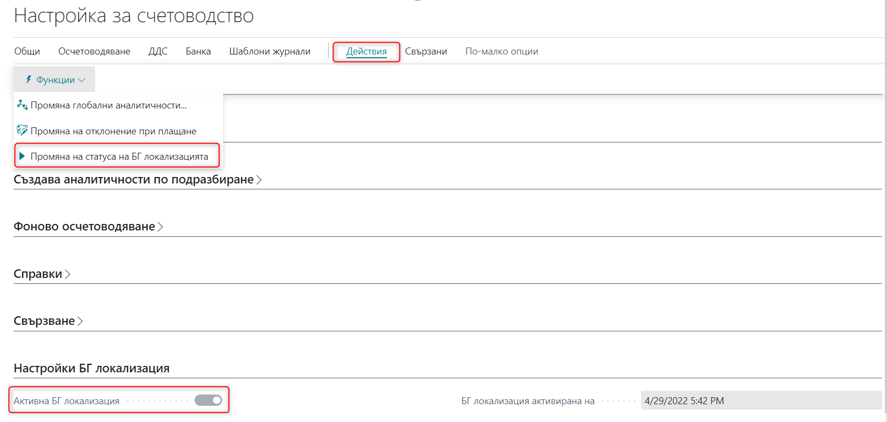{width="6.569770341207349in"
height="3.1305238407699036in"}

# ДДС функционалност

Функционалността за ДДС, като част от пакета Локализация за България,
покрива необходимите изисквания за отчетност по ДДС. По-долу са
разгледани специфичните настройки и начини на работа със системата.

Основното меню за работа с функционалността е изведено в ролевия център
**Счетоводител**:

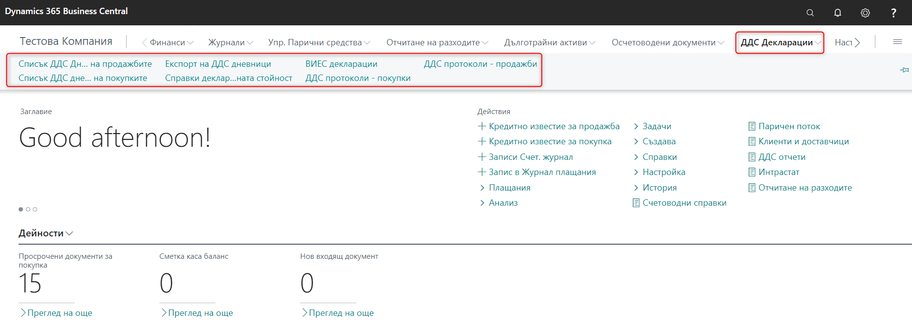{width="6.531944444444444in"
height="2.3631944444444444in"}

## ДДС настройки

### Общи настройки

Първоначалните настройки за ДДС се намират в страница **BG, ДДС и VIES
Настройки**.

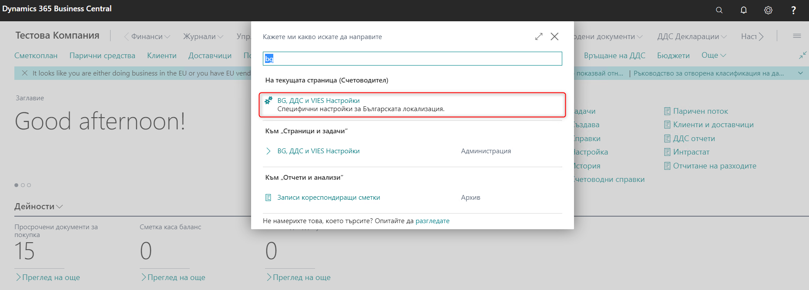{width="6.531944444444444in"
height="2.3472222222222223in"}

Тази страница съдържа специфични настройки относно проверките за
валидност на номерата по ЗДДС и БУЛСТАТ, описания на услугите в
дневниците по ДДС, попълване на определени реквизити при печат на
декларации и документи.

{width="6.531944444444444in"
height="3.0652777777777778in"}

-   Раздел **Проверки**

    -   Без проверка за валидност на **Идентификационен номер** -
        поставете отметка, ако не желаете системата да проверява
        валидността на номерата по БУЛСТАТ

    -   ИН по ЗДДС за чужденци -- попълнете регистрационния номер на
        лицата и фирмите извън ЕС. Този номер служи за контрола при
        попълване на номерата в картите на
        контрагента. (999999999999999) Системата проверява дали
        попълнения ИН по ЗДДС в картата на контрагента съответства на
        попълнения тук номер.

    -   Идентификационен номер на чужденеца -- попълнете регистрационния
        номер на лицата и фирмите извън ЕС. Този номер служи за контрола
        при попълване на номерата в картите на контрагента. (9999999999)
        Системата проверява дали попълнения ИН по ЗДДС в картата на
        контрагента съответства на попълнения тук номер.

    -   Осчетоводяване фактура за покупка - Указва дали е позволено
        осчетоводяване на факт.за пок. с еднакъв док.номер и различна
        дата

-   Раздел **Настройка на експорт с ДДС**

    -   ДДС описание на продажби -- Попълнете описание за продажба,
        което ще се зареди по подразбиране в редовете на Дневника за
        продажби. Ако в даден документ за продажба полето **Описание за
        ДДС** не бъде попълнено, в редовете на дневника ще се попълни по
        подразбиране стойността на това поле.

    -   ДДС описание на покупки -- Попълнете описание за покупка, което
        ще се зареди по подразбиране в редовете на Дневника за покупки.
        Ако в даден документ за покупка полето **Описание за ДДС** не
        бъде попълнено, в редовете на дневника ще се попълни по
        подразбиране стойността на това поле.

    -   Вкл. продажби с митническа декл. -- При попълване на ЕАД No. в
        документа за продажба включването на тази опция позволява този
        документ да се включи в Дневника за продажби

    -   Вкл. покупки с митническа декл. - При попълване на ЕАД No. в
        документа за покупка включването на тази опция позволява този
        документ да се включи в Дневника за покупки

-   Раздел **ДДС етикет**

    -   Представляващ -- въвежда се ЕГН/Трите имена на представляващия.
        Тези данни се отразяват във файла, който се генерира за експорт
        към НАП.

    -   Дата на последна регистрация по ЗДДС -- попълва се датата на
        регистрация на фирмата по ЗДДС

    -   Дата на последно прекратяване на регистрация по ЗДДС -- попълва
        се датата на прекратяване на регистрацията по ЗДДС

-   Раздел **ДДС декларации**

    -   Лице, подписало спр. декл. - въвеждат се имената на лицето,
        отговорно за подаване на ДДС дневниците. Името се печата в ДДС
        дневниците.

    -   Длъжност - въвежда се длъжността на лицето, отговорно за
        подаване на ДДС дневниците. Длъжността се печата в ДДС
        дневниците.

-   Раздел **Локални настройки**

    -   BG код на държава / регион -- Системно поле. Попълва се кода за
        България (BG).

    -   Локален език код -- попълва се BGR за България. Свързано е с
        печата на документи на български език.

### ДДС комбинации

Поддържането на ДДС комбинации е стандартен елемент в настройките на
Dynamics 365 Business central. По-долу са изброени само тези от тях,
които имат отношение към пакета Локализация за България.

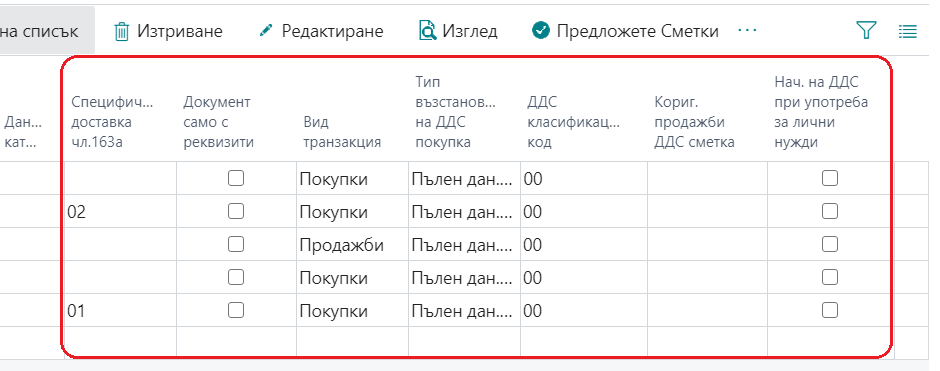{width="6.266666666666667in"
height="2.475in"}

Основните полета при настройките на ДДС комбинациите в локализацията за
България са:

-   **Вид транзакция** -- *Опции*: **Покупка**, **Продажба** или
    **Общо**. Опцията **Общо** се използва при ДДС протоколите;

-   **Тип възстановяване на ДДС покупка --** Опции**: Пълно
    възстановяване, Частично възстановяване, Без възстановяване** и
    **Годишна корекция.** От това поле зависи в коя колона ще влезе
    сумата в дневника. При **Пълно възстановяване** сумите влизат в
    колоните с начисляване на ДДС. Когато е избрана опцията **Без
    възстановяване** и типа на операцията е Покупка, сумата в Дневник
    покупки ще влезе в колоната Без право на ДК. Когато е избрано
    **Частично възстановяване** сумите в дневника ще се попълнят в
    колоните за Частичен данъчен кредит. **Годишна корекция** се
    използва в случай, че трябва да се осчетоводи сума по колона Годишна
    корекция по чл.73, ал.8 (+/-) в дневника за покупки.

-   **Нач. На ДДС при употреба за лични нужди** -- използва се за
    маркиране на комбинацията, използвана за начисляване на данък лични
    нужди. По този начин документът се извежда само в Дневник продажби;

-   **ДДС класификационен код** -- важно е да се отбележи, че за
    комбинациите, които нямат класификационен код трябва да се попълни
    задължително код 00. По-долу са представени комбинациите и тяхното
    описание:

+----+------------------------------------+----------------------------+
| К  | Описание                           | Коментар                   |
| од |                                    |                            |
+====+====================================+============================+
| 00 | Local transactions                 | Покупки и продажби в       |
|    |                                    | страната                   |
+----+------------------------------------+----------------------------+
| 01 | Other Cases Normal VAT             | Избира се когато           |
|    |                                    | комбинацията е свързана с  |
|    |                                    | Данък лични нужди.         |
|    |                                    | Използва се с отметката    |
|    |                                    | Начисляване на ДДС при     |
|    |                                    | употреба за лични нужди.   |
+----+------------------------------------+----------------------------+
| 02 | Purchases according to art. 82,    | Използва се при            |
|    | p.2-5                              | протоколите за ДДС,        |
|    |                                    | описани по-долу.           |
+----+------------------------------------+----------------------------+
| 03 | Subject to 0% VAT acc. to Ch.3 of  | Отразява се в колона 19    |
|    | the VAT Act                        | (Данъчна основа на         |
|    |                                    | доставките със ставка 0 %  |
|    |                                    | по глава трета от ЗДДС)    |
+----+------------------------------------+----------------------------+
| 04 | Subject to 0% VAT, acc. to art.    | Отразява се в колона 21    |
|    | 140,146 and 173, p.1 and 4 of the  | (Данъчна основа на         |
|    | VAT Act                            | доставките със ставка 0 %  |
|    |                                    | по чл. 140, чл. 146, ал. 1 |
|    |                                    | и чл. 173 ЗДДС)            |
+----+------------------------------------+----------------------------+
| 05 | Sales subject to 0% VAT, acc. to   | Отразява се в колона 22    |
|    | art.21, p.3 and art. 22-24 of the  | (Данъчна основа на         |
|    | VAT Act                            | доставки на услуги по чл.  |
|    |                                    | 21, ал. 2 ЗДДС, с място на |
|    |                                    | изпълнение на територията  |
|    |                                    | на друга държава членка)   |
+----+------------------------------------+----------------------------+
| 06 | Transactions acc. to art. 69, p.2  | Използва се при тип        |
|    | of the VAT Act                     | Продажба и тип Общо.       |
|    |                                    |                            |
|    |                                    | Код 06 в дневника за       |
|    |                                    | продажби влиза в колона 23 |
|    |                                    | (Данъчна основа на         |
|    |                                    | доставки по чл. 69, ал. 2  |
|    |                                    | ЗДДС, вкл. Данъчна основа  |
|    |                                    | на доставките при          |
|    |                                    | условията на дистанционни  |
|    |                                    | продажби, с място на       |
|    |                                    | изпълнение на територията  |
|    |                                    | на друга държава членка).  |
|    |                                    |                            |
|    |                                    | В дневника за покупки,     |
|    |                                    | когато е протокол и е с    |
|    |                                    | право на пълен данъчен     |
|    |                                    | кредит, влиза в колони 10  |
|    |                                    | (ДО на получените          |
|    |                                    | доставки, ВОП, получените  |
|    |                                    | доставки почл.82, ал.2-5   |
|    |                                    | от ЗДДС, вноса, както и    |
|    |                                    | данъчната основа на        |
|    |                                    | получените доставки,       |
|    |                                    | използвани за извършване   |
|    |                                    | на доставки по чл.69, ал.  |
|    |                                    | 2 от ЗДДС с право на пълен |
|    |                                    | данъчен кредит) и 11 (ДДС  |
|    |                                    | с право на пълен данъчен   |
|    |                                    | кредит).                   |
|    |                                    |                            |
|    |                                    | В дневника за покупки,     |
|    |                                    | когато е с право на        |
|    |                                    | частичен данъчен кредит -- |
|    |                                    | в колони 12 (ДО на         |
|    |                                    | получените доставки, ВОП,  |
|    |                                    | получените доставки почл.  |
|    |                                    | 82, ал.2-5 от ЗДДС, вноса, |
|    |                                    | както и ДО на получените   |
|    |                                    | доставки, използвани за    |
|    |                                    | извършване на доставки по  |
|    |                                    | чл. 69, ал.2 ЗДДС с право  |
|    |                                    | на частичен данъчен креди) |
|    |                                    | и 13 (ДДС с право на       |
|    |                                    | частичен данъчен кредит).  |
+----+------------------------------------+----------------------------+
| 07 | Subject to 7% VAT charge           | Свързано е с облагаемите   |
|    |                                    | доставки със ставка 7 или  |
|    |                                    | 9 %. Отразява се в колона  |
|    |                                    | 17 от дневника за          |
|    |                                    | продажби.                  |
+----+------------------------------------+----------------------------+
| 08 | Intra-community purchases          | Използва се при            |
|    |                                    | протоколите за ДДС описани |
|    |                                    | по-долу                    |
+----+------------------------------------+----------------------------+
| 09 | Distant sales effected within the  | Код 09 в дневника за       |
|    | territory of another EU member     | продажби влиза в колона 23 |
|    | country                            | (Данъчна основа на         |
|    |                                    | доставки по чл. 69, ал. 2  |
|    |                                    | ЗДДС, вкл. Данъчна основа  |
|    |                                    | на доставките при          |
|    |                                    | условията на дистанционни  |
|    |                                    | продажби, с място на       |
|    |                                    | изпълнение на територията  |
|    |                                    | на друга държава членка)   |
+----+------------------------------------+----------------------------+
| 10 | Sales and Intra-community          | Отразява се в колона 24 от |
|    | acquisitions exempt from VAT       | Дневника за продажби (ДО   |
|    |                                    | на освободени доставки и   |
|    |                                    | освободените ВОП).         |
+----+------------------------------------+----------------------------+
| 11 | Import                             | Само в дневник покупки.    |
|    |                                    |                            |
|    |                                    | Когато е в комбинация Без  |
|    |                                    | право на данъчен кредит в  |
|    |                                    | покупките влиза в колона 9 |
|    |                                    | (ДО и данък нa получените  |
|    |                                    | доставки, ВОП, получените  |
|    |                                    | доставки по чл. 82, ал.2-5 |
|    |                                    | от ЗДДС и вноса безправо   |
|    |                                    | на данъчен кредит или без  |
|    |                                    | данък).                    |
|    |                                    |                            |
|    |                                    | В дневника за покупки,     |
|    |                                    | когато е протокол и е с    |
|    |                                    | право на пълен данъчен     |
|    |                                    | кредит, влиза в колони 10  |
|    |                                    | (ДО на получените          |
|    |                                    | доставки, ВОП, получените  |
|    |                                    | доставки почл.82, ал.2-5   |
|    |                                    | от ЗДДС, вноса, както и    |
|    |                                    | данъчната основа на        |
|    |                                    | получените доставки,       |
|    |                                    | използвани за извършване   |
|    |                                    | на доставки по чл.69, ал.  |
|    |                                    | 2 от ЗДДС с право на пълен |
|    |                                    | данъчен кредит) и 11 (ДДС  |
|    |                                    | с право на пълен данъчен   |
|    |                                    | кредит).                   |
|    |                                    |                            |
|    |                                    | В дневника за покупки,     |
|    |                                    | когато е с право на        |
|    |                                    | частичен данъчен кредит в  |
|    |                                    | колона 12 (ДО на           |
|    |                                    | получените доставки, ВОП,  |
|    |                                    | получените доставки почл.  |
|    |                                    | 82, ал.2-5 от ЗДДС, вноса, |
|    |                                    | както и ДО на получените   |
|    |                                    | доставки, използвани за    |
|    |                                    | извършване на доставки по  |
|    |                                    | чл. 69, ал.2 ЗДДС с право  |
|    |                                    | на частичен данъчен креди) |
|    |                                    | и колона 13 (ДДС с право   |
|    |                                    | на частичен данъчен        |
|    |                                    | кредит).                   |
+----+------------------------------------+----------------------------+
| 12 | Intermediary in triangular         | Свързано с доставки, като  |
|    | operations                         | посредник в тристранни     |
|    |                                    | операции                   |
+----+------------------------------------+----------------------------+
| 13 | Intra-community sales              | Свързано с дневник         |
|    |                                    | продажби и колона 20 (ДО   |
|    |                                    | на доставките със ставка 0 |
|    |                                    | % на ВОД)                  |
+----+------------------------------------+----------------------------+
| 50 | ДДС протокол за компенсация гориво | във форма Настройка        |
|    |                                    | осчетоводяване ДДС, при    |
|    |                                    | режим Редактиране на ДДС   |
|    |                                    | комбинацията за            |
|    |                                    | Компенсацията за ДДС       |
|    |                                    | протокола, в Раздел Общи   |
|    |                                    | има поле Протокол за       |
|    |                                    | компенсация, в което       |
|    |                                    | трябва да се постави       |
|    |                                    | отметка. На база тази      |
|    |                                    | отметка, когато се         |
|    |                                    | генерира ДДС дневник, ДДС  |
|    |                                    | протокол с такава          |
|    |                                    | комбинация ще влиза с код  |
|    |                                    | 50.                        |
+----+------------------------------------+----------------------------+
| 83 | Продажби компенсация гориво        | във форма БГ, ДДС и VIES   |
|    |                                    | настройки в раздел ДДС     |
|    |                                    | етикет е добавено поле     |
|    |                                    | \"Код клиент               |
|    |                                    | компенсация\". В това поле |
|    |                                    | трябва да посочите клиента |
|    |                                    | за който ще се издават     |
|    |                                    | фактурите с горивото,      |
|    |                                    | което ще се компенсира.    |
|    |                                    | Продажбите на този клиент  |
|    |                                    | в ДДС дневника ще влизат с |
|    |                                    | код 83, те няма да се      |
|    |                                    | обединяват, а ще влизат    |
|    |                                    | документ по документ,      |
|    |                                    | защото използват           |
|    |                                    | номерацията на фактурите.  |
+----+------------------------------------+----------------------------+
| 84 | Доставка на хляб                   | В ДДС класификационния код |
|    |                                    | се попълва 00 за ДДС       |
|    |                                    | комбинацията, като в       |
|    |                                    | колона „Специфични         |
|    |                                    | доставки чл.163а" се       |
|    |                                    | попълва код 07. В този     |
|    |                                    | случай в ДДС дневника вида |
|    |                                    | на документа ще се смени   |
|    |                                    | на 84                      |
+----+------------------------------------+----------------------------+
| 85 | Доставка на брашно                 | В ДДС класификационния код |
|    |                                    | се попълва 00 за ДДС       |
|    |                                    | комбинацията, като в       |
|    |                                    | колона „Специфични         |
|    |                                    | доставки чл.163а" се       |
|    |                                    | попълва код 08. В този     |
|    |                                    | случай в ДДС дневника вида |
|    |                                    | на документа ще се смени   |
|    |                                    | на 85                      |
+----+------------------------------------+----------------------------+
| 90 | Само ДДС в дневник продажби        | При осчетоводяване на ДДС  |
|    |                                    | протокол за продажби със   |
|    |                                    | съответните ДДС групи -    |
|    |                                    | този протокол влиза само в |
|    |                                    | дневник продажби с код 09  |
|    |                                    | и се записва само сумата   |
|    |                                    | на ДДС-то в колона 12      |
|    |                                    | (Начислен ДДС за доставки  |
|    |                                    | по к. 11 и начислен данък  |
|    |                                    | (20%),предвиден в закона в |
|    |                                    | други случаи), без основа. |
+----+------------------------------------+----------------------------+
| 92 | Purchases according to art. 82,    | Използва се при            |
|    | p.2-5- в дневник покупки влизат    | протоколите за ДДС описани |
|    | без право на данъчен кредит със    | по-долу                    |
|    | сума на ДДС                        |                            |
+----+------------------------------------+----------------------------+
| 98 | Intra-community purchases - в      | Използва се при            |
|    | дневник покупки влизат без право   | протоколите за ДДС описани |
|    | на данъчен кредит със сума на ДДС  | по-долу                    |
+----+------------------------------------+----------------------------+

## ДДС протоколи

По подобие на покупките и на продажбите, ДДС протоколите могат да се
създадат преди да се осчетоводят. Неосчетоводените протоколи се намират
в списъците **ДДС протоколи - покупка** и **ДДС протоколи - продажба**,
а осчетоводените протоколи - в **Осчет. ДДС протоколи -- покупка** и
**Осчет. ДДС протоколи - продажба**.

Списъците са изведени в основното меню на роля **Счетоводител**:

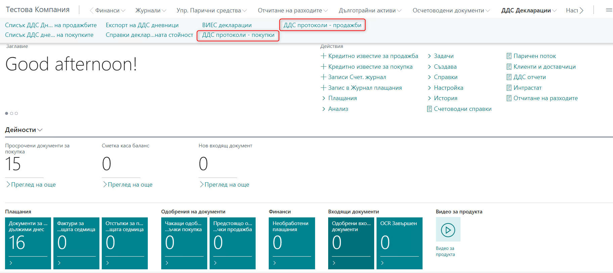{width="6.531944444444444in"
height="2.9166666666666665in"}

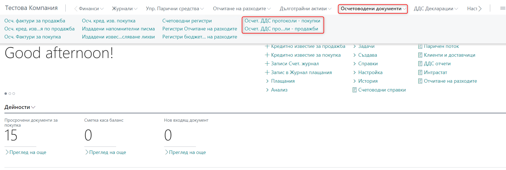{width="6.531944444444444in"
height="2.2in"}

### Настройка на ДДС протоколи

Настройката за числените серии за неосчетоводени протоколи и за
осчетоводени протоколи се намира в **Настройка за счетоводство**.

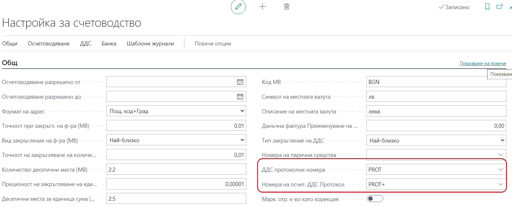{width="6.266666666666667in"
height="2.533333333333333in"}

В прозореца **Настройка на покупки и задължения** е необходимо да се
посочи **ДДС бизнес счетоводната група** за ДДС протоколи**.**

{width="4.095272309711286in"
height="3.0960542432195974in"}

Подобно поле има и в прозореца **Настройка на продажби и вземания**:

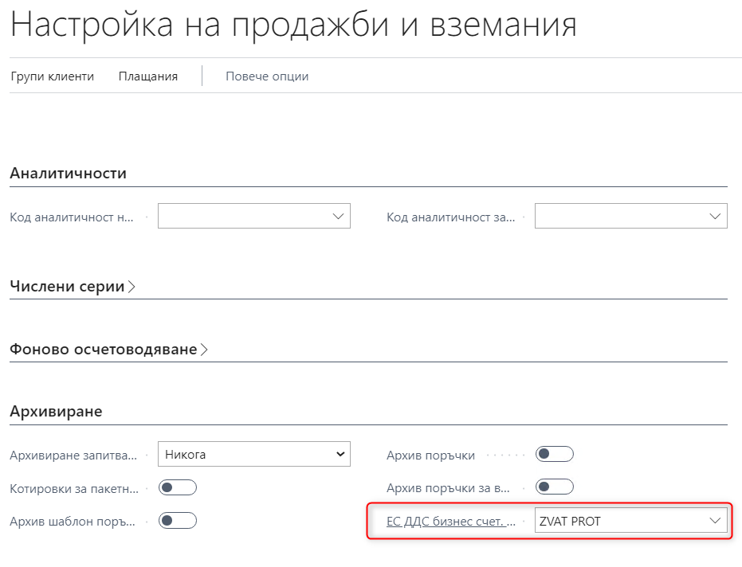{width="4.21141404199475in"
height="3.2210203412073493in"}

### Създаване на ДДС протокол за покупки

За да се създаде нов ДДС протокол за покупки е необходимо той да се
избере от менюто:

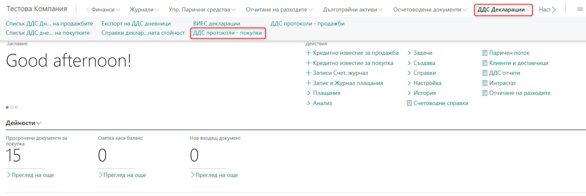{width="6.531944444444444in"
height="2.192361111111111in"}

Отваря се списък, от който избираме бутон **Създаване**

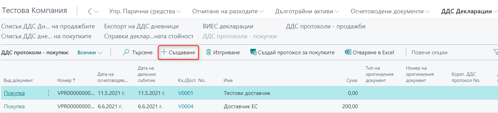{width="6.531944444444444in"
height="1.4909722222222221in"}

В картата, която се отваря, избираме полето **Доставчик No**., за да
може системата да зареди вътрешен номер на протокол.

{width="6.531944444444444in"
height="2.9831189851268594in"}

След това избираме бутон **Копиране на документ**, който отваря
прозорец, където посочваме мястото, от което ще се копират данните му.
Възможните опции се посочени по-долу:

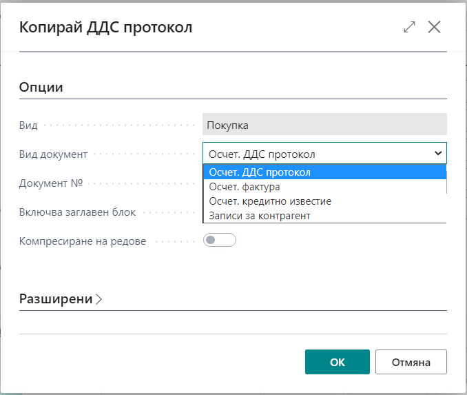{width="3.7417224409448817in"
height="3.1622517497812774in"}

-   **Осчет. ДДС протокол** -- позволява избор на вече осчетоводен ДДС
    протокол

-   **Осчет. фактура** -- позволява избор на вече осчетоводена фактура

-   **Осчет. кредитно известие** -- позволява избор на вече осчетоводено
    кредитно известие

-   **Записи за контрагент** -- позволява избор на записи, когато
    документите за покупка са осчетоводени през Журнал свободни
    операции.

> Опция **Включва заглавен блок** - използва се за да се заредят данните
> от заглавния блок на осчетоводения документ. При опция **Записи за
> контрагент** заглавният блок трябва да се попълни ръчно.
>
> Опция **Компресиране на редове** -- избирането ѝ означава, че редовете
> на копирания осчетоводен документ се обобщават в един ред в създавания
> протокол. В другия случай, когато опцията не е избрана, редовете от
> осчетоводения документ се копират в протокола така, както са въведени
> в документа.

След като са попълнени съответните опции се избира бутона **ОК** и
данните се зареждат в новосъздавания протокол.

{width="6.531944444444444in"
height="2.4284656605424324in"}

Необходимо е да се въведе **Съставител** и **Основание за издаване**.

Може да попълните и поле **ДДС описание**, с което съдържанието му ще се
появи в ДДС дневниците като основание.

ДДС протоколи могат да се създадат едновременно за повече от един
документ. В този случай от списъка на ДДС протоколите за покупка се
избира бутон **Създай протокол за покупки**.

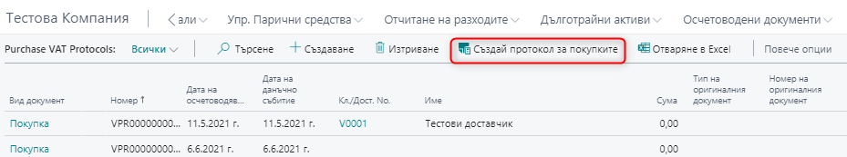{width="6.531944444444444in"
height="1.2159722222222222in"}

При избора на тази опция се отваря прозорец, в който трябва да се въведе
следната информация:

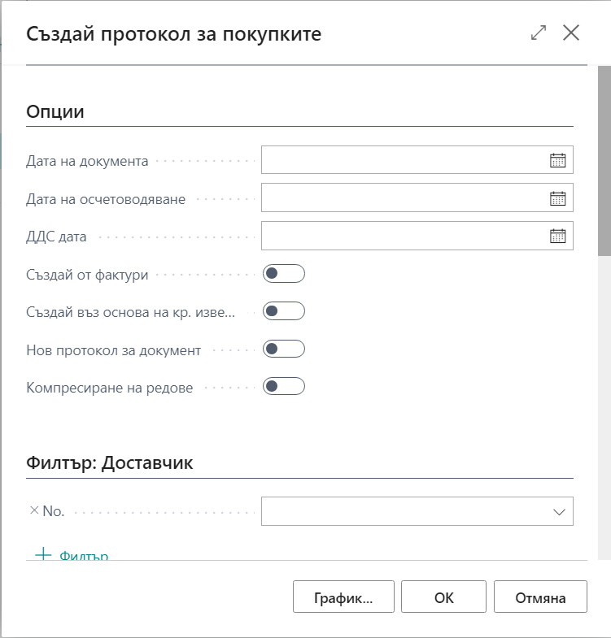{width="4.3262685914260715in"
height="4.522916666666666in"}

-   **Дата на документ** -- попълва се датата на документа на Протокола
    за ДДС -- важи за всички протоколи, които ще се генерират

-   **Дата на осчетоводяване** -- попълва се датата на осчетоводяване на
    Протокола за ДДС - важи за всички протоколи, които ще се генерират.

-   **ДДС дата** -- попълва се датата на данъчното събитие. В случай, че
    тук полето се остави празно, то тогава в генерираните ДДС протоколи
    датата на данъчното събитие ще се вземе от съответното поле в
    оригиналния документ за покупка.

-   **Създай от фактури** -- при избор на тази опция, системата ще
    създаде протоколите от осчетоводени фактури за покупки

-   **Създай въз основа на кред.известия** -- при избор на тази опция
    системата ще създаде протоколите от осчетоводени кредитни известия
    за покупки

-   **Нов протокол за документ** -- при избор на тази опция за всяка
    фактура / кредитно известие ще се създадат отделни протоколи. В
    противен случай системата ще обобщи фактурите и КИ за всеки
    доставчик в един протокол.

-   **Компресиране на редове** -- при избор на тази опция системата ще
    обобщи всички редове от фактурата или кредитното известие в един
    ред. В противен случай всички редове от документа източник ще се
    копират в протокола.

Филтрите по **Доставчик**, **Фактура** и **Кредитно известие** помагат
за допълнително филтриране на документите. Така например може да
посочите във **Филтър: Доставчик -** ДДС бизнес счет.група със
стойността, която е за доставчиците от ЕС (VEND EU). Така ще филтрирате
само тези документи, които са от доставчици от ЕС.

След като протоколите бъдат осчетоводени, системата автоматично поставя
отметка за осчетоводен ДДС протокол в списъка с осчетоводени фактури и
кредитни известия за покупки. По този начин се избягва повторното
генериране на протоколи за едни и същи документи.

### ДДС комбинации при ДДС протоколи

От ДДС комбинациите в редовете на протокола се определя в коя колона от
дневника ще попадне съответния протокол.

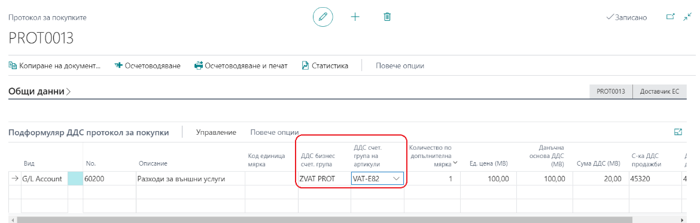{width="6.458333333333333in"
height="2.0650470253718285in"}

Когато ДДС комбинацията за протоколи е маркирана с ДДС класификационен
код 08, в Дневника за покупки протоколът влиза в колона 10 и 11, а в
дневника за продажби в 9,10,13 и 15.

Когато класификационния код е 02, в Дневника за покупки протоколът влиза
в колона 10 и 11, а в дневника за продажби в 9,10,14 и 15.

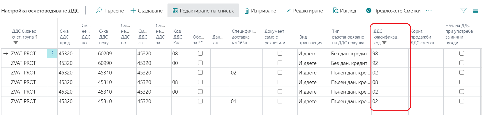{width="6.458333333333333in"
height="1.5434470691163604in"}

Когато протоколът трябва да влезе в ДДС дневника за покупки без право на
данъчен кредит, като сумата на ДДС е включена в тази сума, е необходимо
да се избере комбинация, която включва ДДС класификационни кодове 98 и
92, като за тях **Тип възстановяване на ДДС покупки** е **Без
дан.кредит**. В този случай само при тези два кода в колона 9 на
Дневника за покупки ще се появи сумата на основата с включен ДДС, а
колоните на дневника за продажби са идентични на код 02 и 08.

### Създаване на ДДС протокол включен само в дневник за продажби

ДДС протокол за покупки може да се използва и за осчетоводяване на ДДС
при брак. В този случай се използва функционалността за създаване на ДДС
протокол при използване на стоки и услуги за лични нужди, описана
по-долу. Протоколът ще се включи само в Дневника за продажби. Необходимо
е да се настрои нова ДДС комбинация, за която да има поставена отметка в
поле **Нач. на ДДС при употреба за лични нужди**, както и самият
протокол да бъде маркиран, като протокол за лични нужди.

Класификационен код 90 се използва също за тези случаи. При
осчетоводяване на ДДС протокол за продажби със съответните ДДС групи -
този протокол влиза само в дневник продажби с код 09 и се записва само
сумата на ДДС-то в колона 12 (Начислен ДДС за доставки по к. 11 и
начислен данък (20%),предвиден в закона в други случаи), без основа.

### Анулиране на ДДС протокол

В случай, че се налага да се анулира протокол, то тогава е необходимо от
списъка с осчетоводени протоколи да се отвори картата на съответния
протокол и от меню **Действия** -- **Функции** да се избере **Анулиране
на ДДС протокол**.

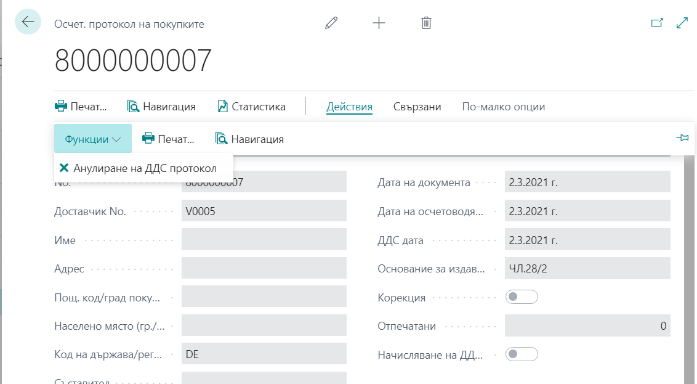{width="6.225in"
height="3.425in"}

Счетоводните операции за анулиране се съставят автоматично, а протоколът
се показва в ДДС дневниците с нулеви суми.

### Коригиращ ДДС протокол -- кредитен протокол

Протоколът за корекция се попълва по аналогичен начин, както ДДС
протокола. При ръчно създаване на протокол за корекция е необходимо да
се маркира полето **Корекция**, като сумите по редовете трябва да са с
положителен знак.

При използване на действие **Копиране на документ**, с което се копират
данни от Кредитно известие, в протокола автоматично се маркира поле
**Корекция**.

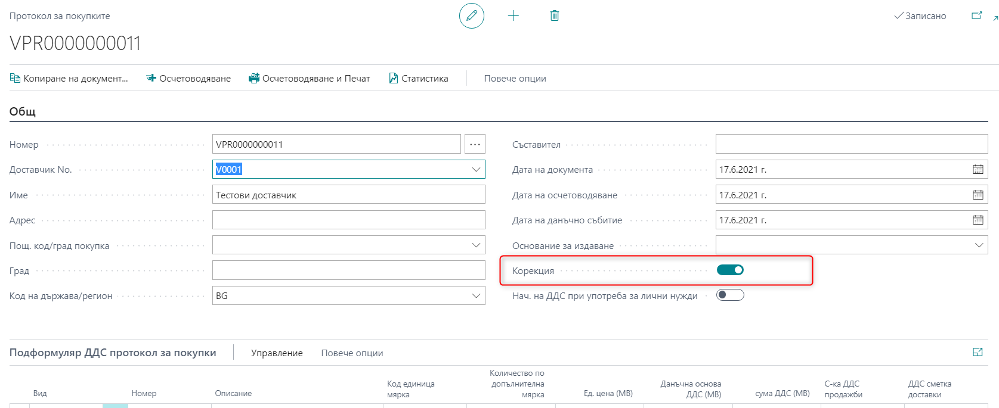{width="6.531944444444444in"
height="2.671527777777778in"}

## ДДС при митническа декларация

За осчетоводяване на ДДС по митнически декларации се използва Журнал
Свободни операции. Препоръчваме да се създаде шаблон за тази операция
със съответните кореспондиращи счетоводни сметки, за да се избегне
многократното им въвеждане при осчетоводяване на всяка една от
митническите декларации.

Удачно е също да се създаде доставчик **Митница**, за който да е
посочена подходяща Счетоводна група на доставчик, така че за него да се
създават записи в съответната счетоводна сметка за Разчети с митница.

В редовете на журнала трябва да се попълнят задължително следните
полета:

-   **Дата на осчетоводяване**

-   **ЕАД No.** -- с номера на митническата декларация;

-   **Общ тип осчетоводяване** -- Покупка;

-   **Сума** -- сумата на ДДС-то от митническата декларация

-   **Вид документ** -- празно

-   **ДДС основание** -- ако не е попълнено ще се попълни с Покупка

-   **ДДС бизнес счетоводна група** -- ZVAT MD (или групата за
    митнически декларации);

-   **ДДС счет. Група на артикула** -- VAT20

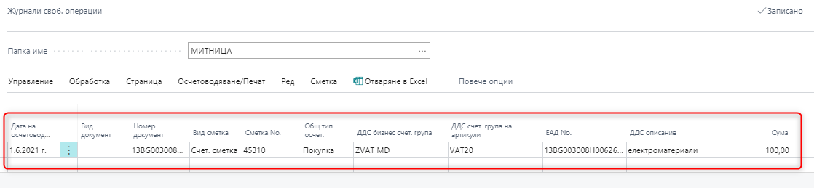{width="6.531944444444444in"
height="1.5131944444444445in"}

Настройките на комбинацията от счетоводни групи, която се използва при
осчетоводяване на ДДС за митническа декларация, трябва да са следните:

-   **ДДС %** - 20;

-   **ДДС начин на изчисление** -- Пълен ДДС;

-   **Вид на транзакцията** -- Покупка;

-   **Тип на възстановяване на ДДС покупка** -- Пълен данъчен кредит

-   **ДДС класификационен код**- 00

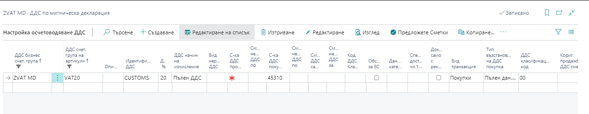{width="6.531944444444444in"
height="1.2763888888888888in"}

Запис в журнал свободни операции, при чието осчетоводяване се използва
комбинация от ДДС счетоводни групи, настроена по посочения начин, ще се
покаже в ДДС дневника като документ с Вид 07.

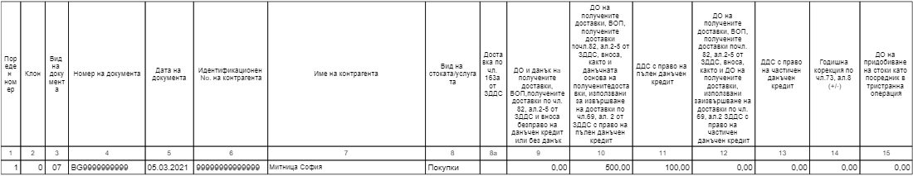{width="6.233333333333333in"
height="1.2083333333333333in"}

## ДДС дневници и декларации

Съгласно българското законодателство е необходимо да се подават следните
декларации:

-   Дневник за покупките;

-   Дневник за продажбите;

-   Справка декларация за данък върху добавената стойност;

-   VIES декларация

Дневниците за ДДС имат набор от задължителни данни, които трябва да
бъдат предоставени за всяка транзакция - номер на документ, тип
документ, дата на документ, име на клиент / доставчик и номер на ДДС
(Булстат), описание на транзакцията, ДДС основа и размер на ДДС.

Сумата на данъчната основа на документа за продажби / покупки и сумата
на данъка са включени в различни колони на книгите по ДДС, в зависимост
от спазването на данъчното законодателство.

Някои транзакции трябва да бъдат изключени от регистрите за ДДС
(например Доставки от трети страни, които се включват в дневниците при
осчетоводяване на митническа декларация).

### Създаване на ДДС Дневници

Датата на осчетоводяване на документа е водеща при включването на
различните видове транзакции в ДДС дневниците. Даден документ ще се
покаже в съответния данъчен период, в случай че датата на осчетоводяване
на документа съответства на периода на Дневниците по ДДС.

Създаването на нов дневник се извършва след достъпване на списъка със
съответните дневници -- за покупки или за продажби. За потребител с роля
**Счетоводител**, те са видни в основното меню:

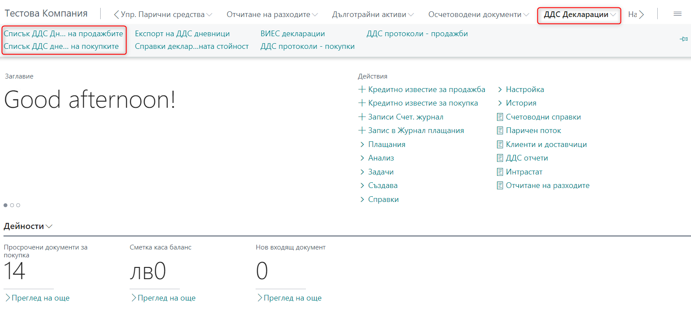{width="6.531944444444444in"
height="2.9493055555555556in"}

От прозореца на списъка с дневниците за покупки или на списъка с
дневниците за продажби може да се създаде нов дневник, а също и да се
разгледа, редактира, изтрие или разпечата съществуващ дневник.

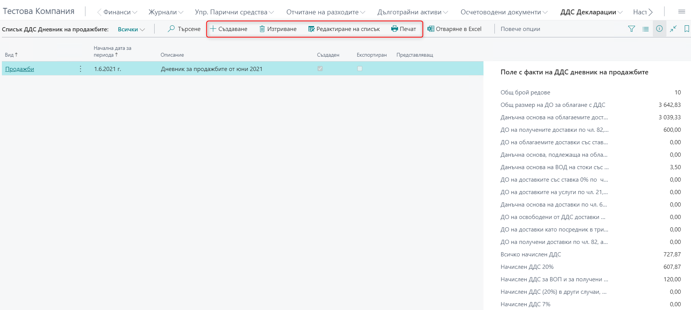{width="6.531944444444444in"
height="2.933333333333333in"}

Създаването на нов дневник се извършва с избор на действието
**Създаване**. Отваря се прозорец, в който е необходимо да се въведе
първия ден от съответния месец, за който се изготвя дневника - в полето
**Начална дата на периода**.

{width="6.531944444444444in"
height="2.2534722222222223in"}

След това е необходимо да се избере **Създава**. При изпълнение на това
действие, данните се зареждат в редовете на документа като на снимката
по-долу.

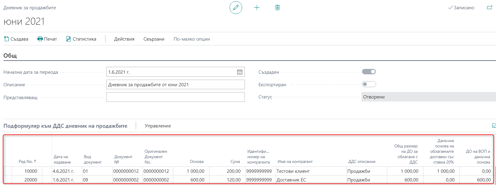{width="6.531944444444444in"
height="2.446527777777778in"}

Записите, включени в дневника са тези, които са осчетоводени в системата
към момента на създаване на дневника и датата им на осчетоводяване е в
рамките на периода, за който се създава дневника. В случай, че след
генериране на дневник се осчетоводят още документи за периода на
дневника, е необходимо той да се генерира отново с бутон **Създава**.

Полетата в ДДС дневника, предоставящи информация за състоянието на
дневника са следните:

-   **Създаден** - указва дали за дневника, за който има вече въведени
    данни в заглавната част, има създадени редове с данни от
    осчетоводените документи

-   **Експортиран** - указва дали данните от дневника са били
    експортирани във файлове за подаване към данъчната администрация.
    Дневник, маркиран като **Експортиран**, не може да бъде променян.

-   **Статус** - указва статуса на дневника: **Отворен** или
    **Стартиран**. Статус **Отворен** означава, че може да се изпълни
    действие **Създаване**, а в случай, че дневникът е вече създаден,
    може да се променят данните в него. Статус **Стартиран** означава,
    че данните в дневника не могат да бъдат променяни и за него не може
    да се изпълни действие **Създаване**.

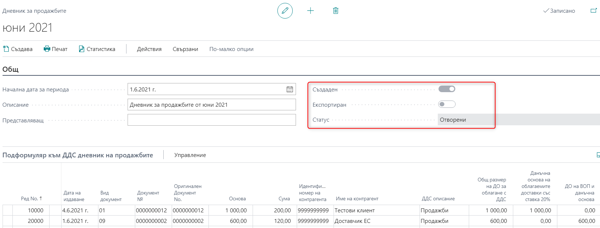{width="6.531944444444444in"
height="2.484027777777778in"}

За всеки един ДДС дневник могат да бъдат изпълнени определени действия,
като мястото за тяхното активиране е в Дневника за продажбите или за
покупките, меню Действия -- Функции.

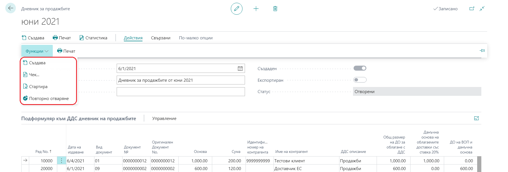{width="6.5in"
height="2.25in"}

Действията са следните:

-   **Създава** -- създава редове в дневника с данни от осчетоводените
    документи. За един дневник действието може да се изпълнява
    многократно. Всяко изпълнение на действието премахва съществуващите
    редове в дневника и ги зарежда отново. За да може да бъде изпълнено
    действието, статусът на дневника трябва да бъде Отворен. Статус
    Отворен за дневник, който вече е придобил статус Стартиран, се
    получава с действие **Повторно отваряне**.

> В случай, че действието Създаване се изпълнява за дневник, който е със
> статус Отворен, но е маркиран като Експортиран, то тогава системата
> извежда предупреждаващо съобщение за това, че дневникът вече е бил
> експортиран.
>
> 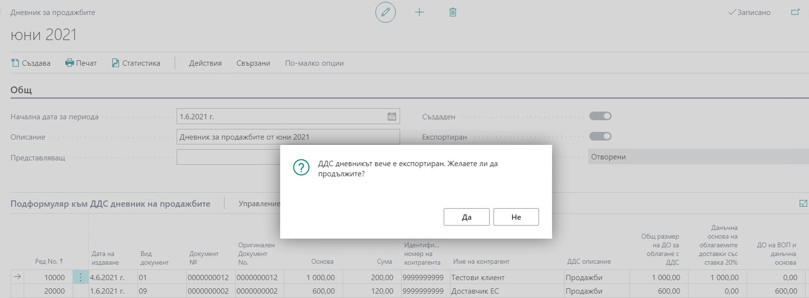{width="6.031350612423447in"
> height="2.2256889763779526in"}
>
> При потвърждение с Да, редовете на дневника се прегенерират, а
> дневникът се маркира като неекспортиран.

-   **Проверка** - проверява създадения дневник за наличие на грешки,
    които биха възпрепятствали приемането на дневника от данъчната
    администрация. Пример за грешка: Не е попълнено поле
    Идентификационен номер на контрагента.

-   **Стартира** - променя статуса на дневника от **Отваря** в
    **Стартиран**. За дневник със статус Стартиран не могат да се
    извършват промени и не може да се изпълни действие Създаване.

-   **Повторно отваряне** - променя статуса на дневника от **Стартиран**
    в **Отваря**. Само за дневник със статус **Отваря** може да бъде
    изпълнено действието Създаване.

След като един дневник се експортира във файл с формат за подаване към
данъчната администрация (описано в т. 2.4.4. Създаване на ДДС файлове),
дневникът автоматично се маркира като **Експортиран.** Освен това в
списъка с дневниците и в самия дневник и статусът му се променя на
**Стартиран**, в случай, че не е променен преди това с действие
**Стартира**.

При необходимост от корекции във вече експортиран дневник, той трябва да
бъде отворен с действие **Повторно отваряне**, след което да се създаде
отново или да се коригира. След като бъдат направени корекциите, за
дневника следва да се създадат нови ДДС файлове.

При избор на даден дневник в дясната част на екрана се показва
**Статистика** свързана с него, от където може да се получи сумарна
информация за записите, включени в съответния дневник.

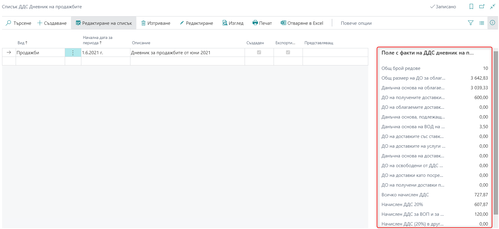{width="6.531944444444444in"
height="3.0083333333333333in"}

С помощта на действие **Печат** дневникът може да се визуализира на
екран, да се разпечата на принтер или да се запази като файл:

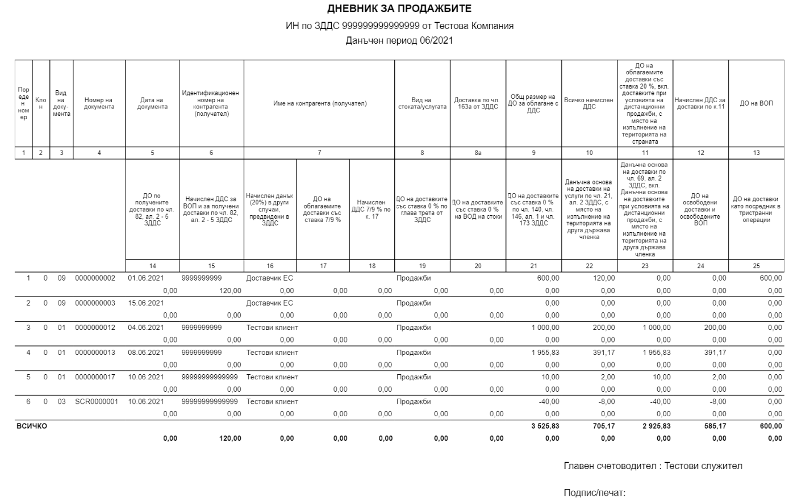{width="6.487378608923884in"
height="4.128583770778652in"}

### Създаване на ДДС Декларация

Създаването на Справка декларация за данък върху добавената стойност се
извършва в страница **Справки декларации за данък върху добавената
стойност**. За роля **Счетоводител** тя се намира в основното меню, в
раздел **ДДС Декларации**.

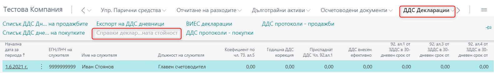{width="6.531944444444444in"
height="0.9756944444444444in"}

Нова декларация се създава чрез бутон **Създаване**. В появилия се нов
ред в списъка с декларации, трябва да се въведе **Начална дата на
периода** - първия ден от декларирания месец. Всички полета за суми в
редовете на декларацията се попълват ръчно (не са изчисляеми),
включително и сумите на ДДС за възстановяване и за приспадане.

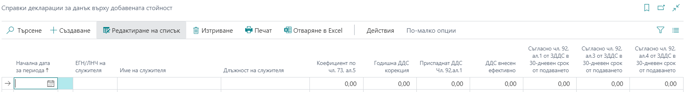{width="6.531944444444444in"
height="0.8826388888888889in"}

Декларацията се генерира след като са генерирани дневниците за покупки и
за продажби. За визуализиране на самата Декларация е необходимо да се
избере бутон Печат. Данните за лицето, отговорно за изготвяне и подаване
на декларацията се въвеждат еднократно и след отпечатване на документа
на принтер или запазване във файл те се запазват и не е необходимо да се
въвеждат при следващ печат. Необходимо е да се маркира, че това лице е
**Представляващ**о дружеството, както и да се посочи **Потвърждение за
коректност на данните**. След като са попълнени тези данни се избира
Преглед или Печат. Справката се визуализира и от нея може да се види
сумата на ДДС за внасяне или за приспадане. След това тази сума трябва
да се въведе по редовете на декларацията (поле **ДДС внесен
ефективно**).

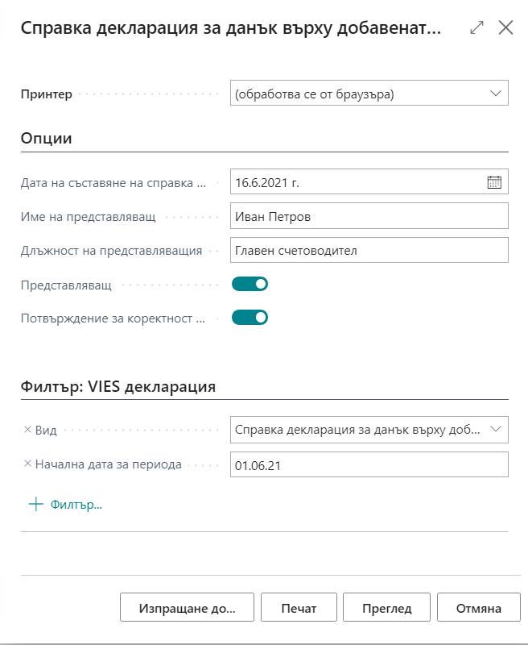{width="2.652541557305337in"
height="3.234806430446194in"}

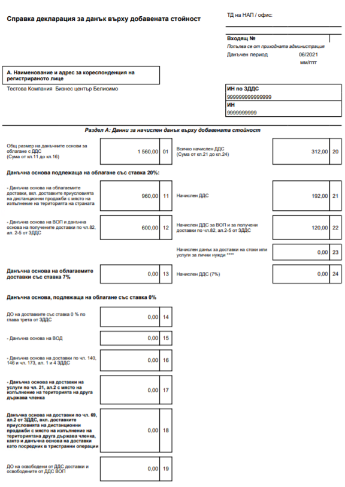{width="4.802449693788277in"
height="6.778456911636045in"}

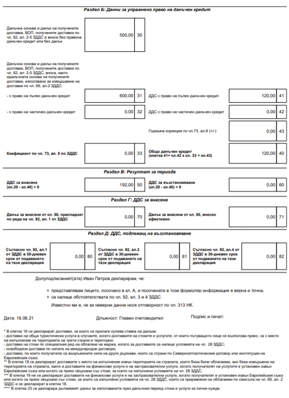{width="4.810787401574803in"
height="6.6283803587051615in"}

### Създаване на VIES декларация

Създаването на VIES декларация се извършва в страница **ВИЕС
декларации**. За роля **Счетоводител** тя се намира в основното меню, в
раздел **ДДС Декларации**.

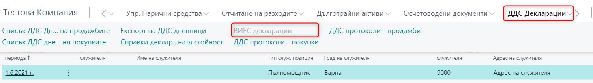{width="6.531944444444444in"
height="0.9166666666666666in"}

Нова декларация се създава чрез бутон **Създаване**.

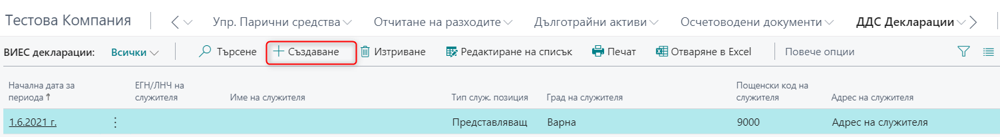{width="6.531944444444444in"
height="0.8951388888888889in"}

Появява се нов ред в списъка с декларации, в който трябва да се въведе
**Начална дата на периода** - първия ден от декларирания месец, както и
данни за служителя, отговорен за изготвяне и подаване на декларацията --
**ЕГН, Име, Тип позиция (представляващ, пълномощник), Адрес**.

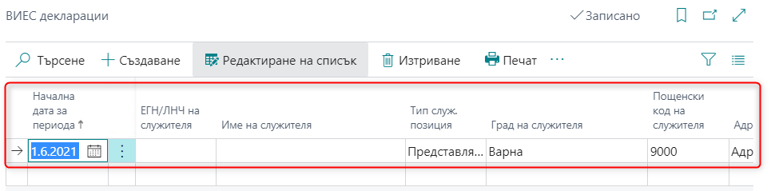{width="5.477896981627296in"
height="1.3563702974628171in"}

Чрез бутон **Печат** се отваря прозорец, в който се подготвя
отпечатването на декларацията.

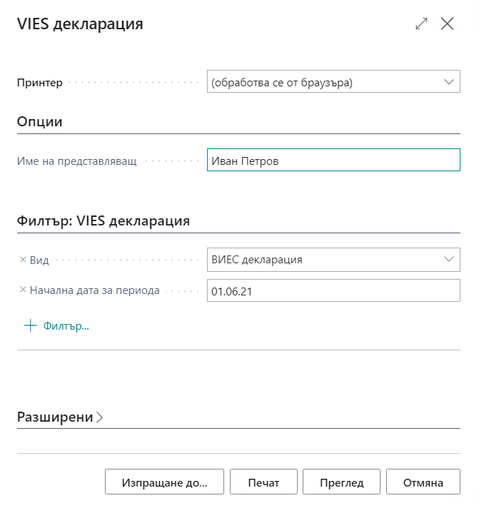{width="3.875191382327209in"
height="4.152402668416448in"}

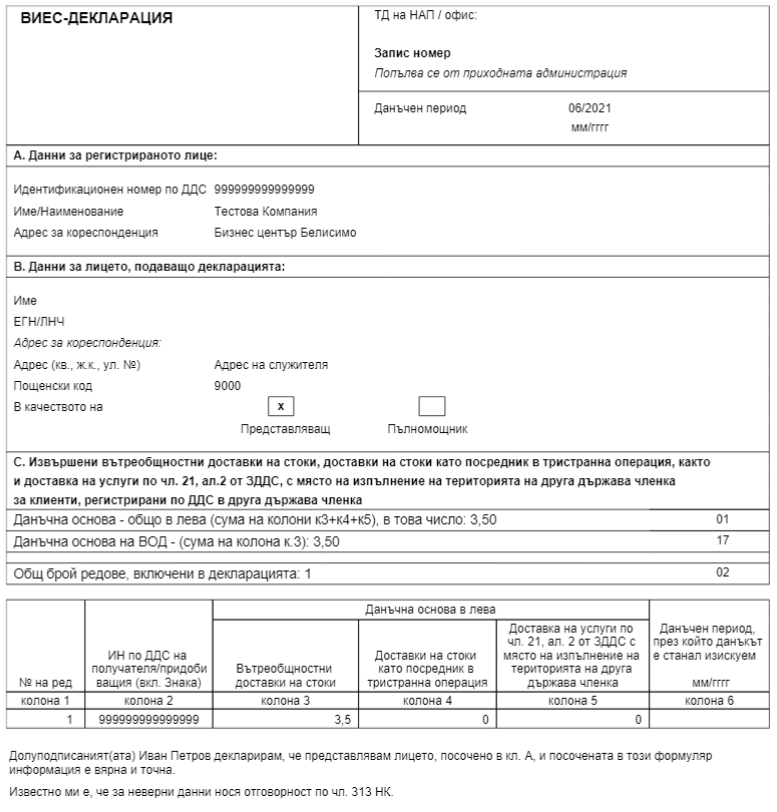{width="6.478303805774278in"
height="6.770119203849519in"}

### Създаване на ДДС файлове

Създаването на файлове за ДДС се извършва в страница **Експорт на ДДС
дневници**. За роля **Счетоводител** тя се намира в основното меню, в
раздел **ДДС Декларации**.

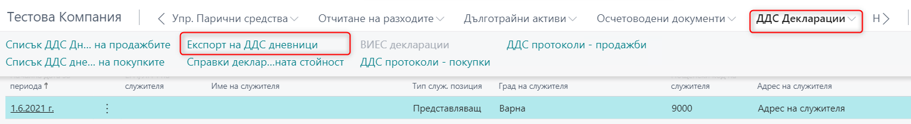{width="6.531944444444444in"
height="0.9006944444444445in"}

Отваря се прозорец, в който се посочват:

-   период -- месец и година, за които се експортират данни

-   дневниците и декларациите, за които ще се създават файлове

-   имената на файловете, които ще се създават

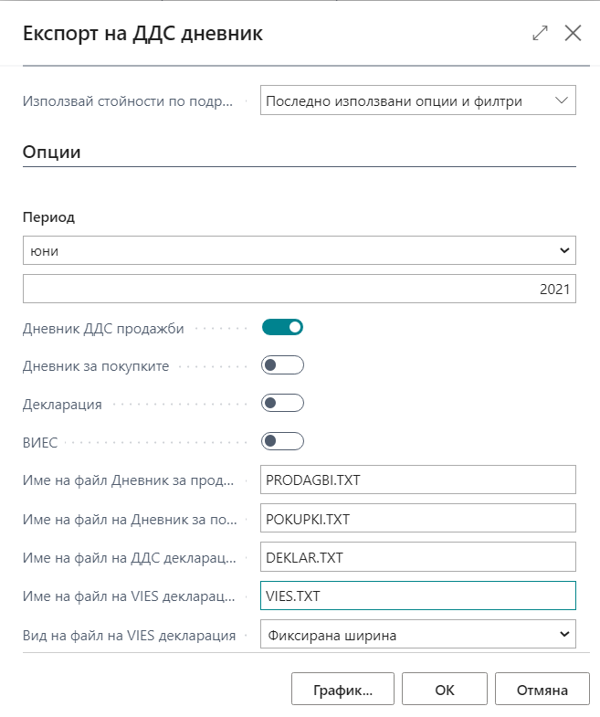{width="4.54041447944007in"
height="5.425in"}

Полетата за имената на файловете се попълват автоматично със стойности,
според изискванията за подаването им в данъчната администрация:

-   PRODAGBI.TXT -- Дневник на продажбите

-   POKUPKI.TXT -- Дневник на покупките

-   DEKLAR.TXT -- Справка-декларация по ДДС

-   VIES.TXT -- VIES Декларация

С бутон ОК се създава един архивен файл, който съдържа всички маркирани
дневници и декларации.

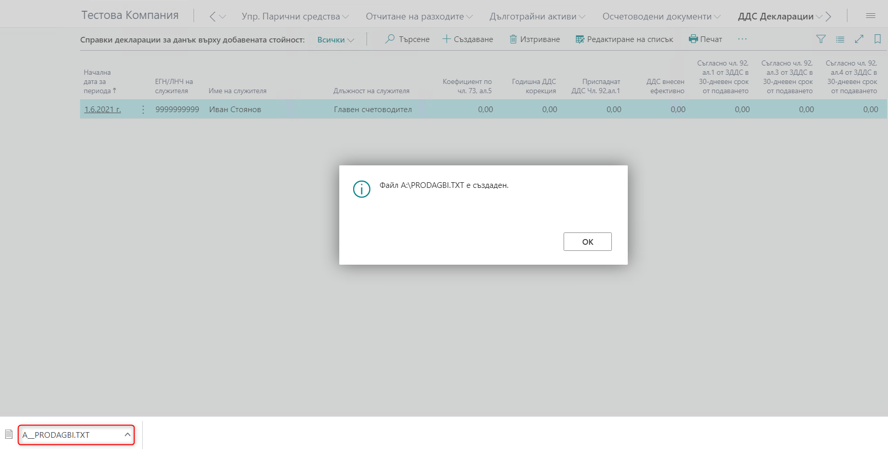{width="6.531944444444444in"
height="3.311111111111111in"}

След като се генерират експортни файлове за дневниците, системата
автоматично маркира тези дневници като Експортирани.

Файловете за ДДС дневниците и за декларациите могат да се генерират
многократно при необходимост от корекция на данните или на други
обстоятелства.

## ДДС при използване на служебни активи за лични нужди

### **Общи условия и правни възможности за деклариране на** ДДС при ползване на служебни активи за лични нужди.

Промените са във връзка с приложението на чл. 6, ал. 3, т. 1 и чл. 9,
ал. 3, т. 1 от ЗДДС и необходимостта регистрираните по ДДС компании да
декларират данъка за ползваните за лични нужди служебни активи с
подаване на месечната справка декларация и дневниците за покупки и
продажби пред НАП. 

С оглед събиране на данни и контрол от страна на органите по приходите е
направено изменение в справка-декларацията и дневника за продажбите, при
което в отделна клетка, съответно колона, регистрираните по ЗДДС лица
декларират начисления от тях данък във връзка с извършени безвъзмездни
доставки на стоки и услуги за лични нужди, приравнени съгласно закона на
възмездни. В допълнение, поради често допускани грешки от данъчно
задължените лица, в долния край на справка-декларацията със звездички са
допълнени пояснения относно доставките, които се декларират в клетките
на справка-декларацията, в които по технически причини не може да се
включи тяхното изчерпателно изброяване, както и относно начисления данък
за доставките на стоки или услуги за лични нужди. По този начин
информацията, която се декларира в посочените клетки от
справка-декларацията, се пояснява и събирането на необходимите за
последващ контрол данни се улеснява.

Данъчно задължените лица, регистрирани по ЗДДС, които използват стока,
включена в стопанските им активи, и за лични нужди, могат да ползват
следните **алтернативни правни възможности:**

1\) да не приспадат данъчен кредит за стоката и за съпътстващите
ползването й разходи и да не начисляват данък за доставката за лични
нужди, или

2\) да упражнят правото на данъчен кредит за стоката и за съпътстващите
ползването й разходи в пропорция, съответстваща на пропорцията на
използването на стоката за стопанската дейност и за лични нужди и да не
начисляват данък за доставката за лични нужди, или

3\) да приспадат данъчен кредит за стоката и/или за съпътстващите
ползването й разходи и да начисляват данък за доставката за лични нужди.

В случай, че лицето е избрало да прилага **първата възможност**, същото
следва да отрази получените данъчни документи за придобиването на
стоката и съпътстващите ползването й разходи в дневника за покупки като
посочи в колона 9 "Данъчна основа и данък на получените доставки, ВОП,
получените доставки по чл. 82, ал. 2 - 5 ЗДДС и вноса без право на
данъчен кредит или без данък" общата сума на данъчната основа и ДДС за
всяка доставка поотделно, съответно в клетка 30 от справка-декларацията
за ДДС.

В случай, че лицето е избрало да прилага **втората** възможност, същото
следва да отрази получените данъчни документи за придобиването на
стоката и съпътстващите ползването й разходи в дневника за покупки като
посочи:

\- в колона 10 "Данъчна основа на получените доставки, ВОП, получените
доставки по чл. 82, ал. 2 - 5 ЗДДС, вносът, както и данъчна основа на
получените доставки, използвани за извършване на доставки по чл. 69, ал.
2 ЗДДС с право на пълен данъчен кредит" стойността на данъчната основа и
в колона 11 "ДДС с право на пълен данъчен кредит" размерът на данъка
върху добавената стойност за всяка доставка поотделно в пропорция,
съответстваща на използването на актива за стопанската дейност,
съответно в клетка 31 и в клетка 41 от справка-декларацията за ДДС и

\- в колона 9 "Данъчна основа и данък на получените доставки, ВОП,
получените доставки по чл. 82, ал. 2 - 5 ЗДДС и вноса без право на
данъчен кредит или без данък" общата сума на данъчната основа и ДДС за
всяка доставка поотделно, съответстваща на пропорцията на използването
на актива за лични нужди, съответно в клетка 30 от справка-декларацията
за ДДС.

В случай, че лицето е избрало да прилага **третата** възможност, същото
следва да отрази:

\- в дневника за покупки - получените данъчни документи за придобиването
на стоката и съпътстващите ползването й разходи като посочи в колона 10
"Данъчна основа на получените доставки, ВОП, получените доставки по чл.
82, ал. 2 - 5 ЗДДС, вносът, както и данъчна основа на получените
доставки, използвани за извършване на доставки по чл. 69, ал. 2 ЗДДС с
право на пълен данъчен кредит" стойността на данъчната основа и в колона
11 "ДДС с право на пълен данъчен кредит" размера на данъка върху
добавената стойност за всяка доставка поотделно, съответно в клетка 31 и
в клетка 41 от справка-декларацията за ДДС;

\- в дневника за продажби:

а) за данъчни периоди до месец януари 2016 г., включително - протоколът,
с който е начислило данък за доставката за лични нужди като посочи в
колона 16 "Начислен данък (20 %), предвиден в закона в други случаи"
размера на начисления данък, съответно в клетка 23 "Начислен данък (20
%), предвиден в закона в други случаи" на справка-декларацията за ДДС;

б) за данъчни периоди месец февруари 2016 г. и следващите - протоколът,
с който е начислило данък за доставката за лични нужди като посочи в
колона 16 "Начислен данък за доставки на стоки или услуги за лични
нужди" се посочва размера на начисления данък, съответно в клетка 23
"Начислен данък за доставки на стоки или услуги за лични нужди" на
справка-декларацията за ДДС.

Когато данъчно задължено лице до началото на 2016 г. е упражнило данъчен
кредит както за стока, която до този момент е ползвало за стопанска
дейност и за лични нужди, така и за извършените преки разходи, свързани
с използването й, и не е начислявало данък върху добавената стойност за
доставката за лични нужди, може, съобразно посочените по-горе
възможности, и след 01 януари 2016 г.:

\- да направи корекция на упражненото право на данъчен кредит за стока и
разходите, свързани с използването й, като приложи съответната пропорция
на ползването за стопанската дейност и за личните нужди. Протоколът се
включва в дневника за покупките като се посочва в колона 10 "Данъчна
основа на получените доставки, ВОП, получените доставки по чл. 82, ал.
2 - 5 ЗДДС, вносът, както и данъчна основа на получените доставки,
използвани за извършване на доставки по чл. 69, ал. 2 ЗДДС с право на
пълен данъчен кредит" стойността на данъчната основа и в колона 11 "ДДС
с право на пълен данъчен кредит" размера на данъка върху добавената
стойност за частта съответстваща на ползването за лични нужди с
отрицателен знак, съответно в клетка 31 и в клетка 41 от
справка-декларацията за ДДС, или

\- да начисли данък пропорционално на размера на ползването. Протоколът,
с който е начислен данъка за доставката за лични нужди се отразява в
дневника за продажби по посочения по-горе начин относно третата
възможност.

Декларирането на начисления данък за доставки за лични нужди и
корекцията на данъчен кредит при използването и отделянето на стоки за
лични нужди се извършва само със справка-декларация за ДДС като лицата
нямат задължение за подаване на други декларации и справки във връзка с
това пред НАП.  

**Документиране на начисляването на данъка при използването на стоки и
услуги за лични нужди.**

Данъкът за безвъзмездна, приравнена на възмездна, доставка на услуга по
чл. 9, ал. 3, т. 1 от ЗДДС се начислява, като се издава протокол не
по-късно от 15 дни от датата, на която данъкът е станал изискуем -- чл.
117, ал. 1, т. 3 от ЗДДС.

Протоколът следва да съдържа следните реквизити:

-   номер и дата;

-   името и идентификационния номер по чл. 94, ал. 2 на регистрираното
    лице --доставчик;

-   количеството и вида на стоката или вида на услугата;

-   датата на възникване на данъчното събитие по доставката;

-   данъчната основа;

-   ставката на данъка;

-   основанието за начисляване на данъка от лицето -- чл. 82, ал. 1 от
    ЗДДС;

-   размера на данъка.

В чл. 80 от ППЗДДС се поставят допълнителни изисквания по отношение на
протоколите, като трайно вписани реквизити, номерация и анулиране и
съхранение.

Протоколът се включва в дневник продажби с код на документ (09), като
размерът на начисления данък се отразява в колона 16 -- Начислен данък
за доставки на стоки или услуги за лични нужди.

Размерът на данъка следва да се включи при определяне на резултата за
съответния данъчен период в справка-декларацията по чл. 125 за този
данъчен период в клетка 23 -- Начислен данък за доставки на стоки или
услуги за лични нужди.

В случаите, когато е избрана тази правна възможност за деклариране на
ДДС при ползване на служебни активи за лични нужди, в Dynamics 365
Business Central е необходимо да се следват стъпките описани по-долу.

###  Настройка на комбинация от ДДС групи в Настройка осчетоводяване ДДС

В меню **Настройка осчетоводяване ДДС** се извършват следните настройки:

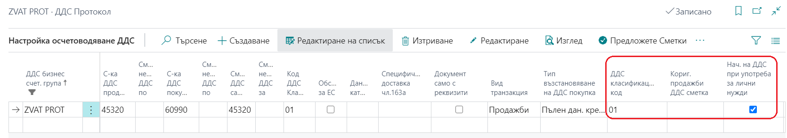{width="6.266666666666667in"
height="1.1083333333333334in"}

Създава се комбинация от **ДДС бизнес счет.група** (протоколи) и **ДДС
счет.група на артикул** (примерно: ДДС за лични нужди). Полетата се
попълват по следния начин:

-   **ДДС начин на изчисление --** Пълен ДДС**;**

-   **ДДС % -** 20**;**

-   **Сметка ДДС продажби --** xxxxx ( смета за ДДС продажби);

-   **Сметка ДДС покупки --** xxxxx (сметка за разходи -- ДДС за лични
    нужди);

-   **Вид транзакция --** Продажби;

-   **ДДС класификационен код --** 01;

-   **Начисляване на ДДС при употреба за лични нужди -**
    {width="0.21666666666666667in"
    height="0.23333333333333334in"}

**Важно:** При осчетоводяване на документи (ДДС протокол) с тази
комбинация, сумата на ДДС ще се отрази в колона 16 -- Начислен данък за
доставки на стоки или услуги за лични нужди на Дневника за продажби и в
клетка 23 -- Начислен данък за доставки на стоки или услуги за лични
нужди на Справка-декларация за ДДС.

В картата на сметката, посочена като „**Сметка ДДС покупки**" не трябва
да има посочени никакви счетоводни групи.

### Настройка в документ ДДС протокол за покупки

За начисляване на ДДС за лични нужди се използва документ **ДДС протокол
за покупки** в програмата. В заглавния блок на документа е добавено поле
**Нач. на ДДС при употреба за лични нужди**.

Поставянето на отметка в това поле маркира документа **ДДС протокол за
покупки** като такъв, в който се начислява ДДС за лични нужди и се
включва само в Дневник за продажби.

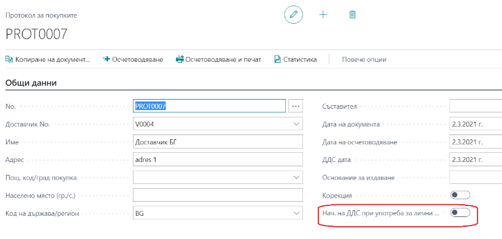{width="3.725in"
height="1.775in"}

В редовете на **ДДС протокол за покупки** е необходимо да бъде посочена
необходимата комбинация от ДДС счетоводни групи:

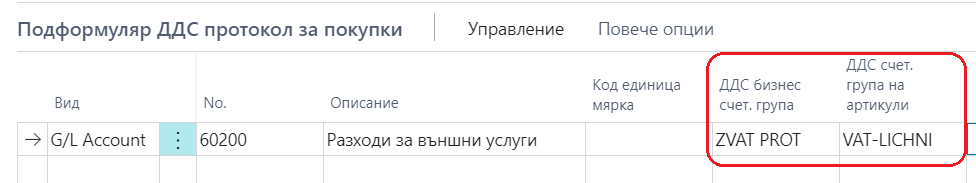{width="4.391666666666667in"
height="0.8416666666666667in"}

**Важно:** Системата извършва проверка за наличие на „маркирани" с
отметки полета:

-   **Начисляване на ДДС при употреба за лични нужди** в прозореца за
    комбинацията от **ДДС счетоводни групи**;

-   **Нач. на ДДС при употреба за лични нужди** в раздел **Общи данни**
    на **ДДС протокол покупки**.

Единствено при наличие на отметки в тези две полета се извършва
съответното осчетоводяване на записа за ДДС за лични нужди.

При наличие на отметка само в едно от полетата, системата извежда
предупреждаващо съобщение за наличие на несъответствие и не позволява
осчетоводяване, преди да е отстранено несъответствието:

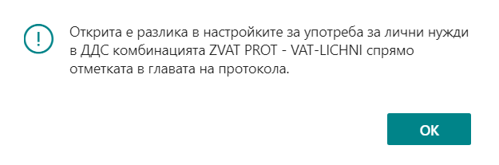{width="3.075in"
height="1.0166666666666666in"}

**Важно:** При създаване на **Протокол за покупки** е препоръчително да
се използва функцията **Копиране на документ** , при което да се маркира
полето **Включва заглавен блок**. По този начин в заглавния блок на
**Протокол за покупки**, в полета **Тип на оригиналния документ** и
**Номер на оригиналния документ** се записват типът и номерът на
копирания документ. Съдържанието на тези полета не може да се редактира
в последствие. Ако при Копиране на документ не се използва маркиране на
поле **Включва заглавен блок**, то полетата в протокола остават празни и
в печатната форма на протокола полето **Към документ** **/ Дата** също е
празно.

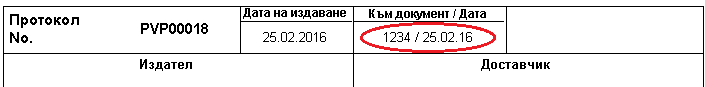{width="6.3in"
height="0.7770833333333333in"}

## ДДС настройки по режим за касова отчетност

Въвеждането на режим „Касова отчетност на ДДС" в националното данъчно
законодателство има за цел подпомагане на малките предприятия, които
срещат затруднения при плащане на данък върху добавената стойност към
бюджета, преди да са получили плащане по извършените от тях доставки на
стоки и услуги от клиентите си.

Режимът касова отчетност се прилага в случаите, когато е налице
облагаема доставка със ставка 20 % ДДС, плащането е задължително по
банков път, доставчикът и получателят са лица, регистрирани по ЗДДС,
които не са свързани лица.

За да се направят необходимите настройки в Dynamics 365 Business Central
са нужни следните стъпки.

### Обща настройка

В страница **Настройка за счетоводство** е необходимо да се постави
отметка в полетата: **Нереализиран ДДС** и **Нереализиран ДДС за
ав.плащане.**

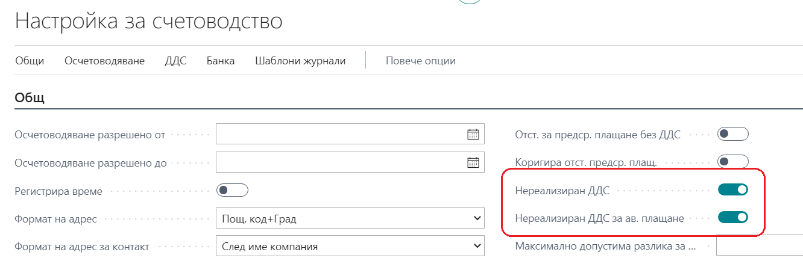{width="6.216666666666667in"
height="2.025in"}

### Създаване на нова ДДС бизнес счетоводна група

В страница **ДДС Бизнес счетоводни групи** е необходимо да се създаде
нова група.

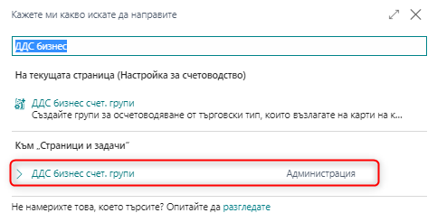{width="5.034617235345582in"
height="2.459978127734033in"}

В посочения пример по-долу е създадена група ZKasova (името е по избор
на потребителя). В колона **Член 151** се поставя отметка в реда на
групата за касови плащания.

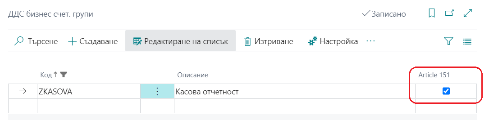{width="6.241666666666666in"
height="1.5333333333333334in"}

### Настройка на ДДС бизнес счетоводната група

В страница **Настройка** **осчетоводяване ДДС** се създава нова
комбинация, включваща ДДС Бизнес счетоводната група за касови плащания.

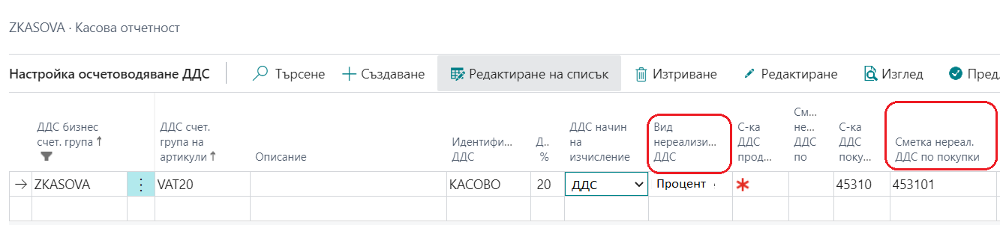{width="6.225in"
height="1.4083333333333334in"}

За новосъздадената комбинация, полетата трябва да са попълнени по
следния начин:

-   **Вид нереализиран ДДС** - опция **Процент**

-   **Сметка нереал. ДДС по покупки** - счетоводна сметка за
    нереализиран ДДС

-   **ДДС %** - 20;

-   **ДДС начин на изчисление** -- ДДС;

-   **Вид на транзакцията** -- Покупка;

-   **Тип на възстановяване на ДДС покупка** -- Пълно възстановяване

-   **ДДС класификационен код**- 00

След като е настроена ДДС комбинацията е необходимо в картата на тези
доставчици, които са регистрирани по режима на Касовата отчетност да се
въведе новата ДДС бизнес счетоводна група.

По този начин във всеки документ за покупка, свързан с доставчик, имащ
настройки по режима за Касова отчетност, ще се зарежда автоматично тази
ДДС бизнес счетоводна група и системата ще разпознава фактурата и
плащанията по нея като документи по режима „Касова отчетност".

### Смяна на ДДС групата във фактура при плащане в брой

Когато се въвежда Фактура за доставка от доставчик, регистриран по този
режим, ако фактурата е в брой е необходимо тя да се разглежда като
обикновена фактура. За тази цел в документа за покупка, който се създава
в системата, е необходимо да се промени **ДДС бизнес счетоводната
група** като се постави групата, която се използва стандартно за
български доставчици, а не тази, посочена като ДДС група за касова
отчетност.

Промяната на **ДДС бизнес счет. Група** се извършва в заглавния блок на
Поръчката за покупка или на Фактурата за покупка от раздел **Детайли за
фактура**.

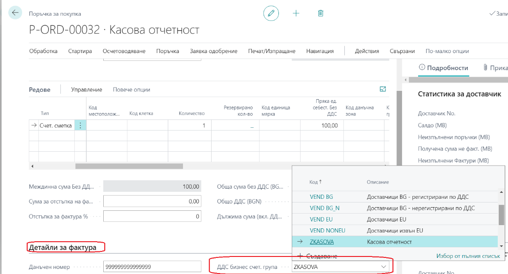{width="5.016666666666667in"
height="2.7in"}

От списъка с **ДДС бизнес счет. Групи** се избира и поставя необходимата
група. При това системата извежда предупредително съобщение, което
трябва да се потвърди с избор на **Да.**

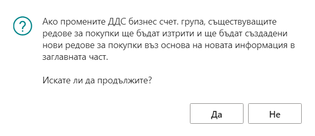{width="3.033333333333333in"
height="1.3083333333333333in"}

**ВАЖНО**: Препоръчително е да промените **ДДС бизнес счетоводната
група** преди да въведете редовете в поръчката или във фактурата за
покупка. В случай че по редовете вече е въведена счетоводна сметка,
сумата ще се изтрие и е необходимо да се въведе отново. В случаите че е
бил въведен артикул и за реда е направена ръчна корекция на цена или на
отстъпка, групата също трябва да се въведе наново.

При осчетоводяване на документа системата издава предупредително
съобщение, за да се избегне грешка при евентуална смяна на групите. В
случай че плащането е в брой, отговорът на съобщението трябва да е
**Не** (**No**).

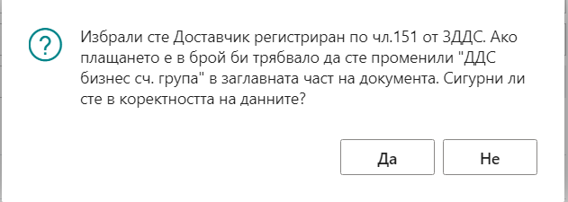{width="2.316666666666667in"
height="0.825in"}

### **Отразяване на плащанията по фактура „Касова** отчетност"

В случаите на осчетоводяване на фактура по режима за касови плащания,
стойността на ДДС се отразява в отделна сметка. При свързване на
Фактурата с Плащането, сумата автоматично се прехвърля от тази сметка в
сметката за ДДС. Датата, на която се осчетоводява тази операция е
датата, на която е направено свързване на фактурата с плащането.
Фактурата може да се свърже с плащането преди да е получен Протокола за
това плащане. Препоръчително е свързването да се извършва от страницата
със записа за плащането, а не от фактурата.

### Въвеждане на протокол за плащане на фактура по „Касова отчетност"

Въвеждането на протокола се извършва от **Записи за доставчик** (**Карта
на доставчик** -- **Записи**).

Избира се фактурата, за която е получен Протокол. След като се маркира
фактурата е необходимо от бутон **Функции** да се избере опция
**Нанасяне на протоколи**.

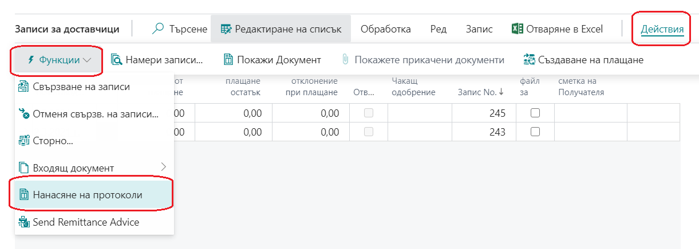{width="6.208333333333333in"
height="2.225in"}

Извеждат се всички записи за плащания на съответната фактура. В полета
**Дата на Протокол** и **№ на Протокол** се записват датата и номера на
протокола. Една фактура може да се плати с няколко протокола. В този
екран ще се появят и въведените до момента протоколи към избраната
фактура.

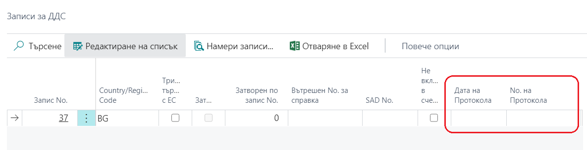{width="6.225in"
height="1.6in"}

След като са въведени дата и номер на протокола, страницата трябва да се
затвори. Датата на протокола трябва да е в рамките на месеца, в който е
свързан записа. В противен случай системата ще изведе съобщение за
грешка. Записът за Протокола се показва в ДДС дневника в месеца, в който
е свързан записа (датата на осчетоводяване на ДДС). В случай на
разминаване в месеците на свързване и протокол е необходимо плащането да
се развърже от фактурата и отново да се върже с дата от месеца, в който
е издаден протокола.

Генерирането на ДДС дневниците и Справката декларация остава по
стандартния начин.

## ДДС настройки при извършване на дейности по чл. 163.

Съгласно българското законодателство са въведени специални режими за
обратно начисляване на ДДС при отразяване на сделките с отпадъци и
зърнени и технически култури. Обратното начисляване е специфичен данъчен
инструмент, при който данъкът се начислява от получателя, а не от
доставчика. Механизмът изисква данъкът да е изискуем от получателя по
сделката, който трябва да е регистрирано по ЗДДС лице, независимо дали
доставчикът е регистрирано по ЗДДС лице или не е.

Във връзка с тези изисквания в Dynamics 365 Business central е
необходимо да се направят следните настройки.

### Създаване на нови ДДС счетоводни групи на артикули

Необходимо е да се създадат нови **ДДС счетоводни групи на артикули.**
Това се извършва в **с**траницата **ДДС счетоводни групи на артикули**.
Страницата може да бъде открита чрез действие Търсене:

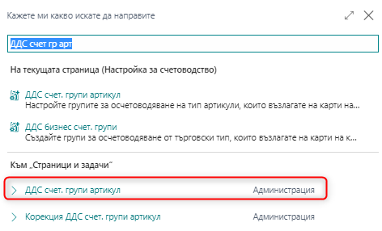{width="4.919957349081365in"
height="2.981160323709536in"}

В примера по-долу са създадени групите VAT_GRAIN и WASTE.

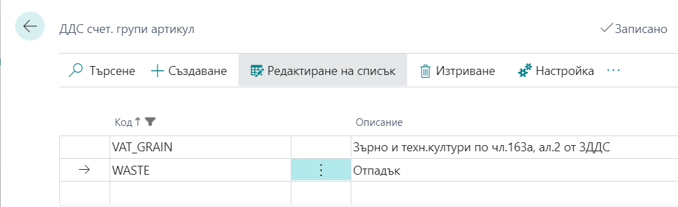{width="6.233333333333333in"
height="1.9083333333333334in"}

### Настройка на комбинация от ДДС групи при продажба

В **Настройка на осчетоводяване ДДС** се извършват следните настройки за
новите групи за артикули:

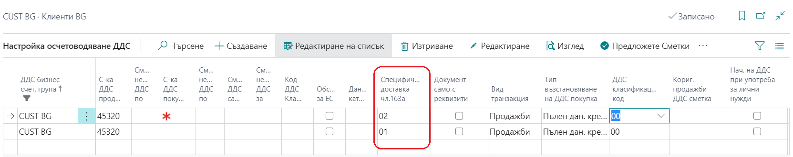{width="6.233333333333333in"
height="1.2416666666666667in"}

Създават се комбинации от **ДДС бизнес счет.група** на клиенти от
България и новите **ДДС счетоводни групи на артикули**. Полетата в
комбинациите се попълват по следния начин:

-   **ДДС начин на изчисление --** ДДС

-   **ДДС % -** 0

-   **Сметка ДДС продажби --** xxxxx

-   **Вид транзакция --** Продажби

-   **Специфична доставка чл.163а --** 01 или 02

-   **ДДС класификационен код --** 00

В страница **Настройка на осчетоводяване ДДС** е добавена ново поле
**Специфична доставка по чл.163а**. В това поле за комбинацията от
счетоводни групи, използвана при отразяване на продажба на отпадъци се
посочва код 01, а при отразяване на продажба на зърнени храни - 02.

  -----------------------------------------------------------------------
  Код     Описание
  ------- ---------------------------------------------------------------
  01      Доставка по част I на приложение 2 от ЗДДС

  02      Доставка по част II на приложение 2 от ЗДДС
  -----------------------------------------------------------------------

Когато се продават артикули, включени в някоя от новите групи (отпадъци
или зърнени и технически култури) , е необходимо в картата на артикула
да се промени **ДДС счет. група на артикула** като се посочи съответната
новосъздадена група.

В случай че по редовете на документа за продажба се посочва приходна
счетоводна сметка, подходящо е да се използва такава сметка, в чиито
настройки е посочена съответната **ДДС счет. група на артикул**. В
случай че се използва една и съща сметка за продажба при облагаеми и при
необлагаеми сделки, тогава е необходимо в редовете на Поръчката или на
Фактурата за продажба да се промени **ДДС счет. група на артикул**.

### Настройка на комбинация от ДДС групи при покупка

Начисляването на данъка в този случай ще се извършва от получателите по
доставките с издаването на протокол. Протоколът може да е общ за всички
доставки, за които данъкът е станал изискуем през съответния данъчен
период, когато доставчиците са физически лица, които не са данъчно
задължени. Фактурите за доставки с обратно начисляване трябва да
съдържат като основание „обратно начисляване чл.163а, ал.2 от ЗДДС".

Обратно начисляване няма да се прилага при  вътреобщностни доставки и
придобивания (доставки от и към български лица с контрагенти от
държави-членки на Европейския съюз), в случаите на тристранни операции,
внос и при облагаеми с нулева ставка доставки на стоки извън територията
на Европейския съюз.

В страница **Настройка на осчетоводяване ДДС** се извършват следните
настройки за новите групи:

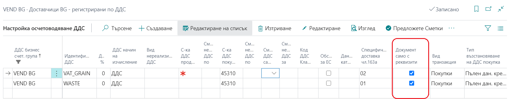{width="6.175in"
height="1.1916666666666667in"}

Създават се комбинации от **ДДС бизнес счет.група** на доставчици от
България и новите **ДДС счетоводни групи на артикули**. Полетата в
комбинациите се попълват по следния начин:

-   **ДДС бизнес счет.група --** Доставчик от България**;**

-   **ДДС начин на изчисление --** ДДС**;**

-   **ДДС % -** 0**;**

-   **Сметка ДДС покупки --** xxxxx**;**

-   **Вид транзакция --** Покупки**;**

-   **Документ само с реквизити --** Да**;**

-   **Специфична доставка чл.163а --** 01 или 02

-   **ДДС класификационен код --** 00**;**

В случай че осчетоводяването на доставката е директно по счетоводна
сметка, то тогава е необходимо да се смени **ДДС счет.група на артикул**
на реда в документа за покупка като се посочи съответната нова
счетоводна група за артикула.

Документите за покупка на артикул, който е настроен като отпадък или
като зърнена култура, трябва да се показват в ДДС дневниците без сума.

### Протокол за самоначисление

За протоколите за самоначисление в страница **Настройка на
осчетоводяване ДДС** е необходимо да се добавят комбинации от групи,
които да включват новите **ДДС счет. група на артикули.**

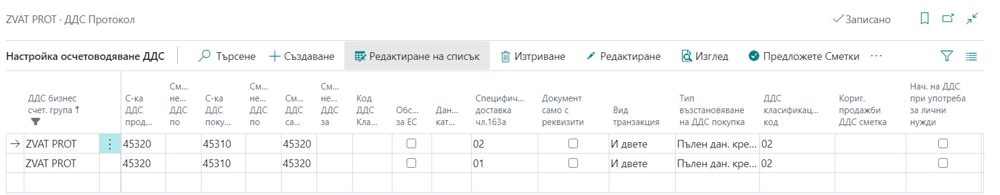{width="6.183333333333334in"
height="1.2083333333333333in"}

Създават се комбинации от **ДДС бизнес счет.група** за ДДС протоколи и
новите **ДДС счетоводни групи на артикули**. Полетата в комбинациите се
попълват по следния начин:

-   **ДДС начин на изчисление --** Пълен ДДС**;**

-   **ДДС % -** 20**;**

-   **Сметка ДДС продажби --** xxxxx**;**

-   **Сметка ДДС покупки --** xxxxx**;**

-   **Сметка ДДС възстановяване --** xxxxx**;**

-   **Вид транзакция --** Общо**;**

-   **Специфична доставка чл.163а --** 01 или 02**;**

-   **ДДС класификационен код --** 02**;**

Създадено е ново **Основание за издаване** на протокол за самоначисление
**Обратно начисляване на ДДС чл.163А ал.2 от ЗДДС**, както и ново
**Основание за неначисление на ДДС** - **Обратно начисляване на ДДС
чл.163А ал.2 от ЗДДС.**

**Важно:** Когато се осчетоводява Протокол за отпадъци или зърнени
култури е необходимо да се промени **ДДС счет. група на артикули** по
редовете на протокола. В случай че не бъде променена, протоколът ще се
покаже в ДДС дневника без необходимите реквизити.

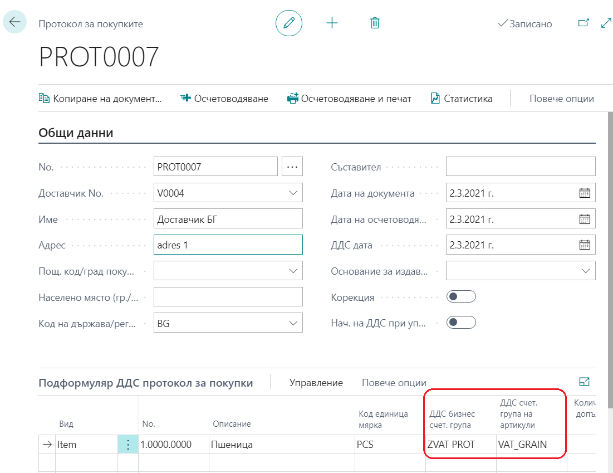{width="4.316666666666666in"
height="3.325in"}

# Интрастат

Системата **Интрастат** се прилага за събирането на данни за
вътрешно-общностни изпращания и/или пристигания на стоки, осъществени
между Република България и страните-членки на Европейския съюз.
Задължени лица за подаване на декларации по система **Интрастат** --
Интрастат оператори, са лицата регистрирани по Закона за данък върху
добавената стойност, които осъществяват вътрешно-общностна търговия със
стоки в годишни обеми, изразени в стойност, над определени прагове за
деклариране. Интрастат операторите са задължени да подават месечна
Интрастат декларация.

По-долу са описани някои стандартни за системата функции, както и
допълнения към пакета Локализация за България, които помагат за
отчитането по Интрастат.

## Интрастат настройки

Необходимите данни за Интрастат декларациите са показани на снимката
по-долу. Част от тези данни могат да бъдат предварително попълнени в
картата на доставчик и в картата на артикул. Въведени по този начин те
ще бъдат пренесени в документите, в които се избират съответните
доставчик и артикул.

  

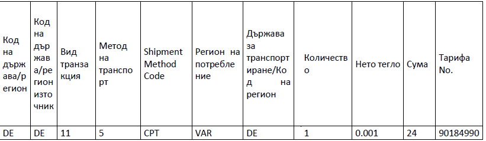{width="6.531944444444444in"
height="1.9006944444444445in"}

### Общи настройки 

В карта на **Доставчик** се въвеждат данни в следните полета:

-   **Код на държава/регион (Country/Region code)**

-   **Код метод експедиция (Shipment Method code)**

-   **Вид транзакция (Transaction Type)**

-   **Метод на транспорт (Transport Method)**

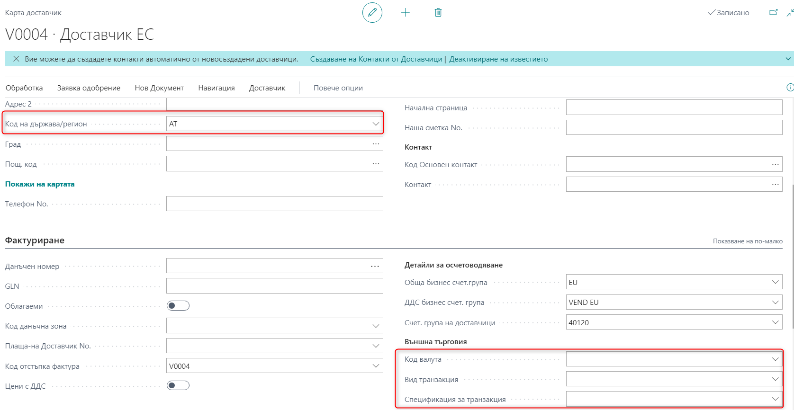{width="6.531944444444444in"
height="3.375in"}

Те се пренасят в поръчката за покупка, ако са попълнени за съответния
доставчик, избран в поръчката.

В карта на **Артикул** се попълват следните полета:

-   **Код на държава/регион източник (Country/Region of Origin code)**

-   **Нето тегло (Net Weight)**

-   **Тарифа No. (Tariff number)**

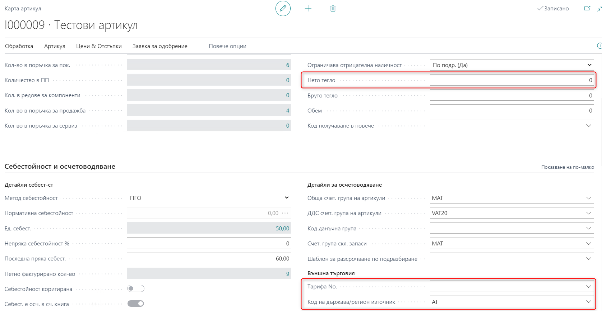{width="6.531944444444444in"
height="3.3826388888888888in"}

В **Поръчка за покупка** се попълват следните полета:

-   **Регион на потребление (Area) -** при пристигания, това е регион
    (област) в България

-   **Държава за транспортиране/код на регион (Transport country/Region
    code) -** Националност на транспортното средство (Посочва се
    2-значния буквен код на държавата, чийто превозвач е използван за
    транспортиране на стоката. Посоченият код може да бъде на всяка от
    държавите от Геономенклатурата.)

Желателно е тези полета да бъдат попълнени в поръчката за покупка преди
нейното осчетоводяване. Данните се намират в раздел **Външна търговия**
на поръчката за покупка.

 

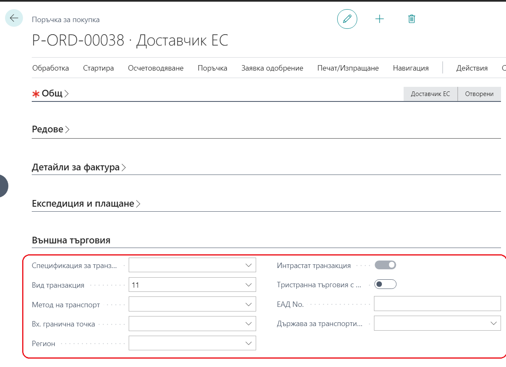{width="4.741666666666666in"
height="3.441666666666667in"}

 

В страница **ДДС Справка Конфигуриране** е необходимо да се поставят
еднократно съответните настройки.

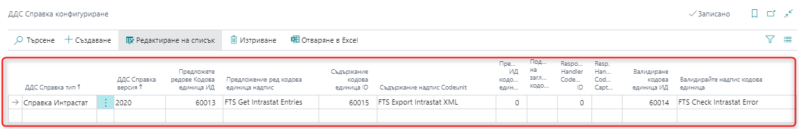{width="6.531944444444444in"
height="1.0583333333333333in"}

-   **ДДС справка тип** -- Справка Интрастат

-   **ДДС справка версия** -- 2020

-   **Предложете редове Кодова единица ИД** -- 46026517 или 60013 (FTS
    Get Intrastat Entries)

-   **Съдържание Кодова единица ID** -- 46026519 или 60015 (FTS Export
    Intrastat XML)

-   **Валидиране кодова единица ИД** -- 46026518 или 60014 (FTS Check
    Intrastat Error)

В страница **Настройка Интрастат** се правят следните настройки**:**

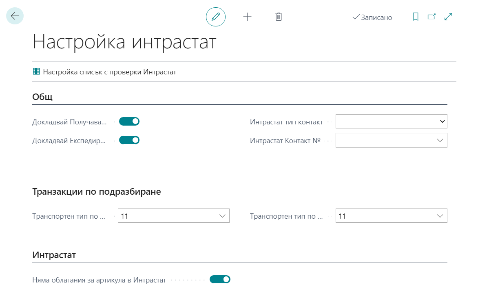{width="6.531944444444444in"
height="4.050694444444445in"}

-   **Докладвай получавания** -- маркира се, ако искате да генерирате
    декларация само за получаванията

-   **Докладвай Експедирания** -- маркира се, ако искате да генерирате
    декларация само за експедиранията

-   **Транспортен тип по подразбиране --** посочва се типа на
    транзакцията по подразбиране за експедиционните бележки и разписки
    за покупки (11 Стандартна покупка / продажба)

-   **Транспортен тип по подразбиране -- Връщания --** посочва се типа
    на транзакцията по подразбиране за връщане на експедиционните
    бележки и разписки за покупки (11 Стандартна покупка / продажба)

-   **Няма облагания за артикула в Интрастат --** ако е сложена отметка
    тук системата не позволява включване на допълнителния разход към
    сумите за Интрастат транзакции.

В системата има вградени проверки при осчетоводяване на документ от ЕС
за попълване на задължителните полета за Интрастат в случай, че в
документа е включен артикул.

В Интрастат декларацията данните за Тарифния номер и Нетното тегло се
вземат от Карта на артикул, а страна произход от Складовата разписка и
Експедиционната бележка.

Страна произход на артикула се зарежда в тези документи от Карта на
артикул, но тя може да бъде променена в тях. В случай че не бъде
въведена в документите за получаване или за експедиция, кодът на
държавата няма да се попълни в журнала.

### Маркиране на страни/държави, обект на Интрастат деклариране 

При попълването на Интрастат декларацията се използва номенклатура на
страните и териториите, или т.н. Геономенклатура, съгласно Commission
Implementing Regulation (EU) 2020/1197.

В Dynamics 365 Business central в страница **Държави/региони** срещу
всяка държава се попълва съответния код за Интрастат.

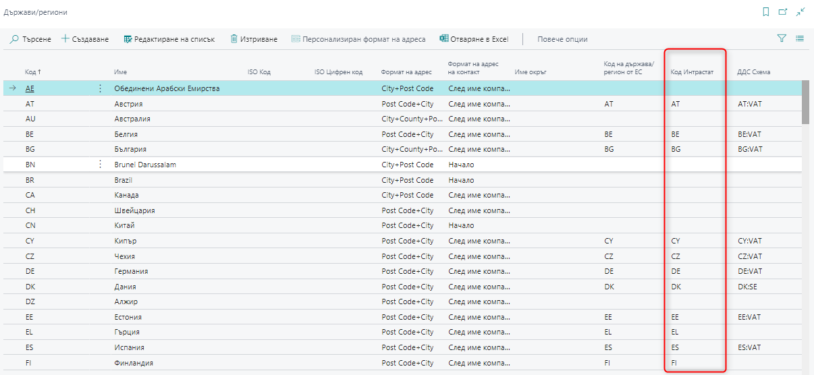{width="6.531944444444444in"
height="3.011111111111111in"}

Обект на Интрастат деклариране са записите за артикули, които са
доставени/продадени на контрагенти с държава, маркирана с Интрастат код
в таблицата с държави (независимо от това, каква е страната на произход
на артикулите).

### Номенклатури за Интрастат

Във  **Финанси - Настройка -- Интрастат**, се намират всички специфични
номенклатури, които се използват при генериране на Интрастат декларация.
Тъй като те са част от стандартния пакет на Dynamics 365 Business
Central тяхното попълване и настройка не се разглежда в тази
документация.

Тези номенклатури могат да се открият и чрез изписване на част от името
в полето за Търсене на основното меню.

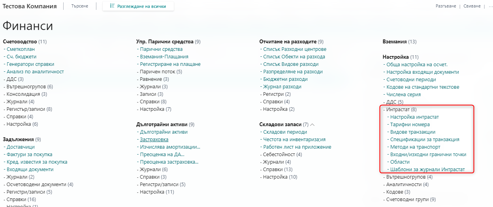{width="6.531944444444444in"
height="2.747916666666667in"}

### Настройка на допълнителни разходи към сумата за Интрастат декларацията

Пакетът Локализация за България позволява да се настрои допълнителния
разход като част от стойността в Интрастат декларацията.

В страница **Допълнителни разходи** се маркират следните колони:

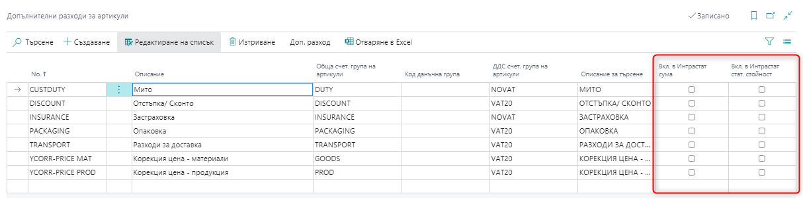{width="6.531944444444444in"
height="1.6194444444444445in"}

-   **Вкл. в Интрастат сума** -- маркира се ако искаме допълнителния
    разход да се включи в колона Сума

-   **Вкл. в Интрастат стат.стойност** -- маркира се ако искаме
    допълнителния разход да се включи в колона Статистическа стойност

В страница **Методи експедиция** се поставя отметка на този метод, за
който стойността на транспорта се включва в сумата за Интрастат.

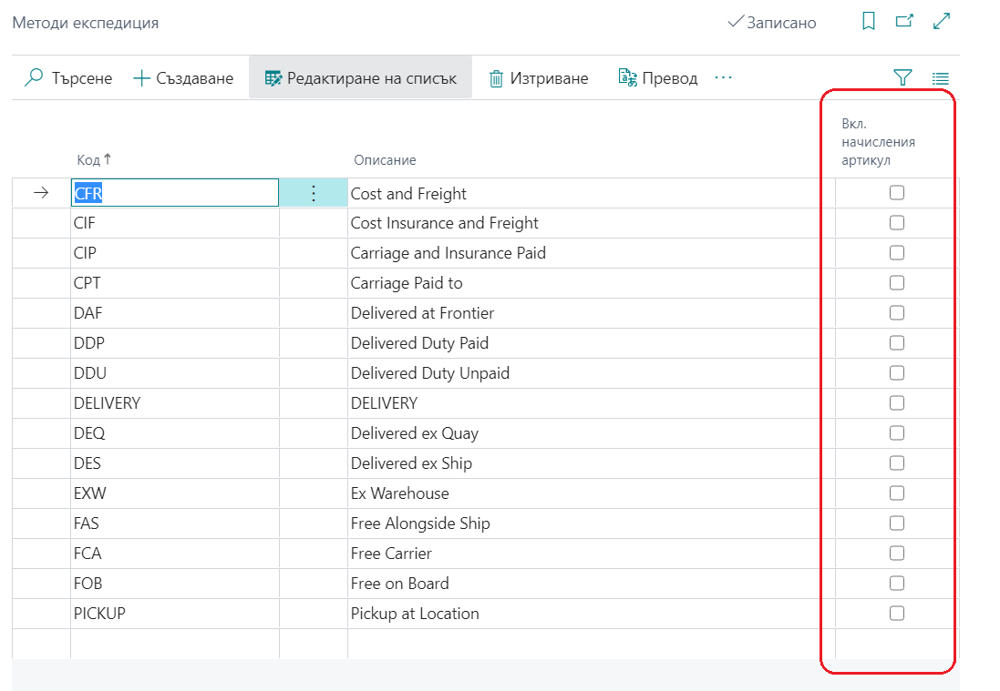{width="6.033333333333333in"
height="4.175in"}

В **Настройка на покупки и задължения** се маркира отметка **Интрастат
журнал вкл. допълнителни разходи**, с която се позволява добавянето на
допълнителни разходи към сумата за Интрастат.

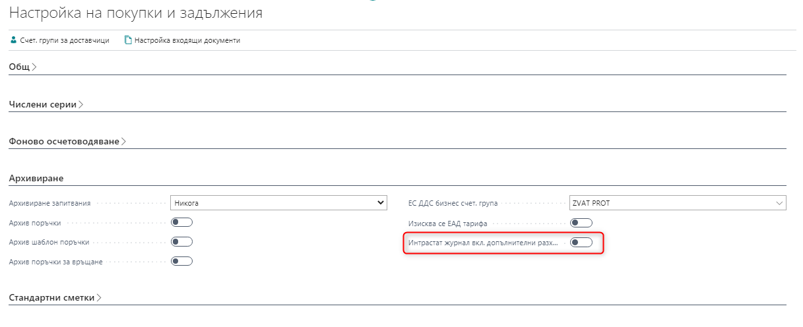{width="6.531944444444444in"
height="2.6618055555555555in"}

## Създаване на нов журнал за Интрастат

 

Мястото за създаване на журнал Интрастат е страница **Журнал
Интрастат**, която можем да намерим в основното меню.

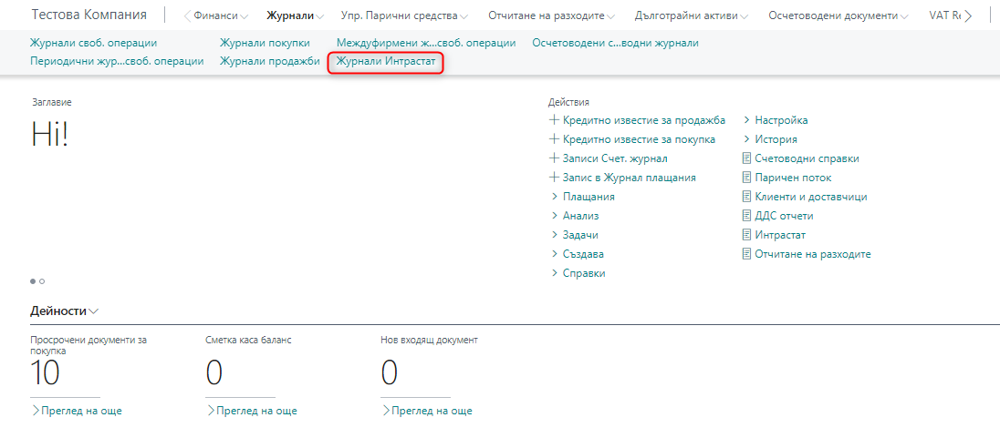{width="6.531944444444444in"
height="2.8666666666666667in"}

Следващата стъпка е да се избере действие Създаване.

Задава се Име и статистически период. Статистическият период се въвежда
като първо се записват последните две цифри на годината и след това
месецът, за който ще се подава декларацията. Пример за Статистически
период: 2011 - ноември 2020 година.

{width="6.531944444444444in"
height="1.8097222222222222in"}

 

### Генериране на записи в журнал Интрастат

>  

След като е създаден журнала, се избира действие **Предложение за
редове,** при което в него се зареждат записите за артикулите, на базата
на които ще се генерира декларацията.

Това са записите, които са маркирани като „Intrastat transaction", и за
които поле **Код на държава/регион** съдържа кодове, посочени като
Intrastat Code в таблицата с държави, независимо от това, каква е
страната на произход на артикула.

{width="6.531944444444444in"
height="2.1527777777777777in"}

 

Необходимо е да се направи проверка за липсващи данни в журнала. Ако има
такива те могат да се попълнят ръчно в журнала. Другият вариант е те да
се попълнят в съответните карти (на артикули, доставчици, и т.н.), след
което отново да се изпълни действието **Предложение за редове**.
Препоръчително е за артикулите предварително да бъдат попълнени нетни
тегла и тарифни номера (в картите им). Без тези полета декларацията няма
да се подаде коректно.

В таблица **Записи в книга артикули** има добавени полета свързани с
Интрастат транзакциите като - тарифен номер, митническа декларация,
нетно тегло, страна на произход, страна на транспорт, метод на транспорт
и т.н. По тях лесно могат да се правят допълнителни справки.

Препоръчително е да се провери и стойността на декларацията. Възможна е
следната проверка: В **Записи в книга артикули** да се филтрира по
съответния период на осчетоводяване, **Вид запис** (Покупка) и по **Код
държава/регион** (\<\>''&\<\>BG). Сумата **Общо себестойност
(действителна)**, се сравнява със стойността на декларацията --
**Статистическа стойност**.

Сумата **Общо себестойност (действителна)** съдържа транспортните
разходи, ако такива се разпределят като допълнителен разход в поръчките
за покупка.

### Генериране на файлове за декларация 

След като данните в журнал Интрастат са проверени, се извършва
експортирането им чрез бутона **Създаване на файл**.

{width="6.531944444444444in"
height="2.286111111111111in"}

В страницата **XLM код на Интрастат декларация** се попълват данните на
Лицето за контакт:

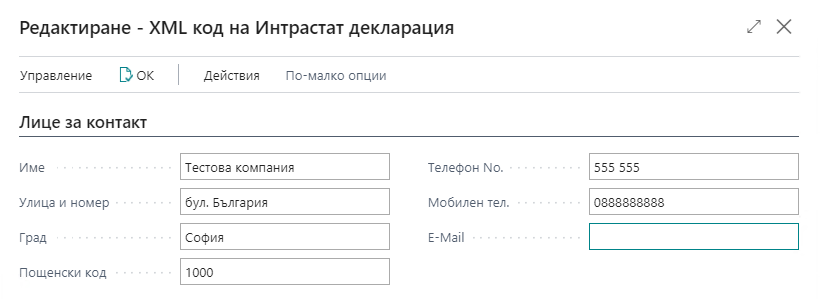{width="4.39587489063867in"
height="1.6025360892388452in"}

Декларацията се експортира в две стъпки:

Първа стъпка - в поле **Описание декларация** се посочва **Получено** и
след това се избира бутон **OK**.

Втора стъпка - в поле **Описание декларация** се посочва **Експедирано**
и след това се избира бутон **OK**.

Генерираните файлове могат да се открият в папка Downloads на компютъра.

** **

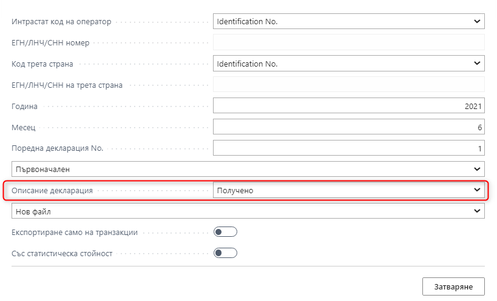{width="4.393489720034996in"
height="2.6661745406824147in"}

Локализацията позволява и да се създадат само файлове с транзакции,
които да се заредят в програмата на Интрастат и оттам да бъде направено
подаването на декларацията. В този случай се ползва опцията
**Експортиране само на транзакции.** Системата генерира файлове за внос
и износ (на две стъпки), които могат да се импортират в софтуера за
Интрастат деклариране на данъчната администрация, откъдето да се създаде
декларацията.

Ако декларациите трябва да включват статистическа стойност, се маркира и
опцията **Статистическа стойност**.

# Финанси -- настройки, свързани с локализацията

Пакетът Локализация за България поддържа допълнителни функционалности,
които надграждат основния модул Финанси в Dynamics 365 Business Central.

## Автоматично създаване на аналитичности

Автоматичното създаване на аналитичности позволява поставяне на стойност
на предварително зададена аналитичност при създаване на нов клиент или
на нов доставчик.

За да се използва тази функционална възможност е необходимо в страница
**Настройка за счетоводство,** раздел **Създава аналитичности по
подразбиране** да се посочи следното:

-   В **Таблица на клиента,** поле **Аналитичност** -- код на
    аналитичността, която ще се поставя автоматично в картата на
    новосъздаден клиент

-   В **Таблица на доставчика,** поле **Аналитичност** -- код на
    аналитичността, която ще се поставя автоматично в картата на
    новосъздаден доставчик

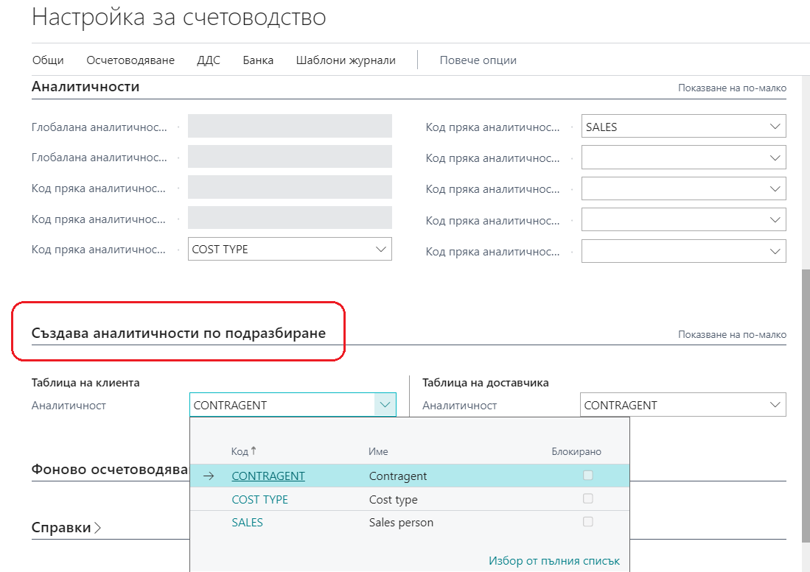{width="6.531944444444444in"
height="4.618055555555555in"}

При създаване на нов клиент или на нов доставчик, в системата
автоматично се извършва следното:

-   В картата на клиента или на доставчик се добавя съответната
    аналитичност, посочена в **Настройка за осчетоводяване**

-   Създава се и се поставя нова стойност за добавената аналитичност.
    Новата стойност на аналитичността има код, съвпадащ с кода на
    клиента или на доставчика и име - името на клиента или на
    доставчика. При промяна на името в картата на клиента или на
    доставчика, то се променя и името на стойността на аналитичността.

Аналитичностите по подразбиране спомагат за по-голяма съгласуваност на
отчетите. Техните стойности винаги се добавят към документите и записите
за конкретните клиенти, доставчици.

## Журнал свободни операции

В Журнал свободни операции са добавени следните полета:

-   **ЕАД No.** -- попълва се с номер на Единния административен
    документ - митническа декларация

-   **ДДС описание** -- попълва се с описание, което ще се покаже в ДДС
    дневника в поле **ДДС описание.** Например: **Покупки**

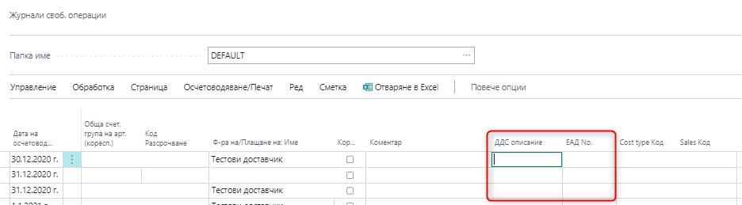{width="6.531944444444444in"
height="1.8069444444444445in"}

## Регистър на оборотна ведомост

Справката Регистър на оборотна ведомост е допълнително разработена
справка, която служи за представяне на данните по счетоводни сметки във
вид, удобен за проследяване на началното салдо, оборотите за съответния
период (дебит и кредит) и формираното крайно салдо.

Справката се стартира от страница **Регистър на оборотна ведомост**. Тя
се намира и в основното меню на роля **Счетоводител**:

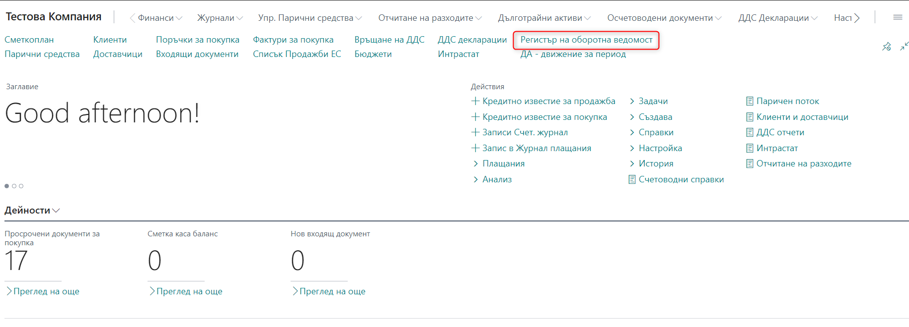{width="6.531944444444444in"
height="2.3555555555555556in"}

След стартиране на справката се избират следните опции:

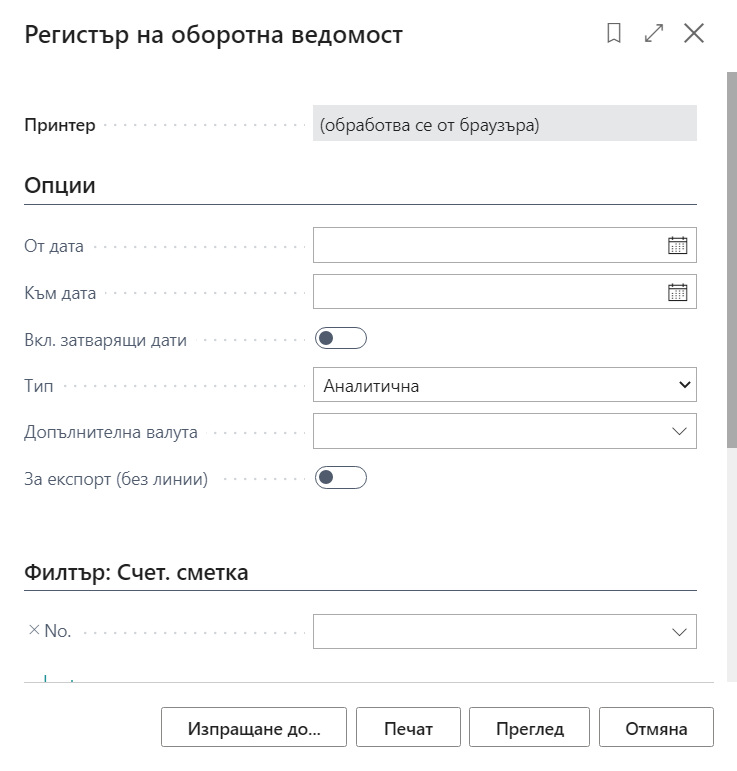{width="3.683333333333333in"
height="3.8583333333333334in"}

-   **От дата** -- начална дата на периода

-   **Към дата** -- крайна дата на периода

-   **Вкл. затварящи дати** -- използва се, когато в справката трябва да
    се включат записи, направени в системата след приключване на
    счетоводните сметки

-   **Тип** - Синтетична или Аналитична. Синтетичната оборотна ведомост
    извежда счетоводните сметки от тип Сумарни, когато има настроени
    подобни сметки в сметкоплана. Например ако има въведени няколко
    сметки от група 602 и има създадена сметка 60290, която е посочена
    като сумарна и за това сумиране е използвана функционалността на
    програмата за отстъпите на сметки (Сумиране Начало -- Сумиране
    Край), тогава в отчета ще се изведе само сметка 60290. При
    Аналитичната оборотна ведомост няма да се появи сметка 60290, а
    всички сметки включени в сумирането.

-   Допълнителна валута -- задава се ако се ползва допълнителна отчетна
    валута

-   За експорт (без линии) -- не се печатат линии на редовете в
    справката

> Допълнително могат да се посочат избрани сметки в раздел **Филтър:
> Счет.сметка.**
>
> След потвърждение чрез бутон Преглед справката се визуализира на
> екрана:

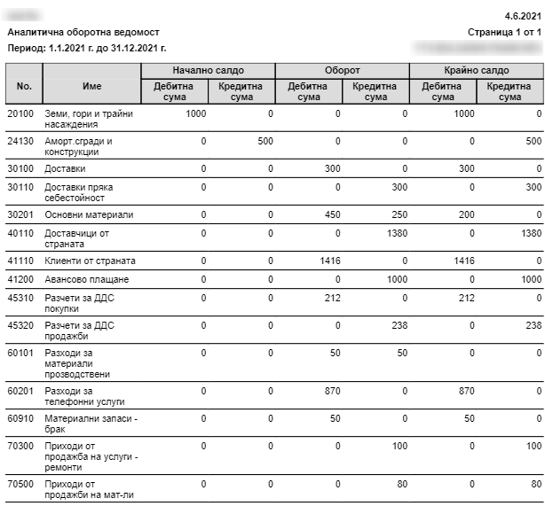{width="6.401808836395451in"
height="5.95347331583552in"}

## Дълготрайни активи

Като допълнение към справките в модула за дълготрайни активи, пакетът
Локализация за България предлага и разработени справки за данъчен и
счетоводен амортизационен план.

Справка **ДА -- движение за период** съдържа цялата информация,
необходима за ДАП и САП. Стартира се от страница **ДА -- движение за
период**. Тя се намира в основното меню на роля **Счетоводител**:

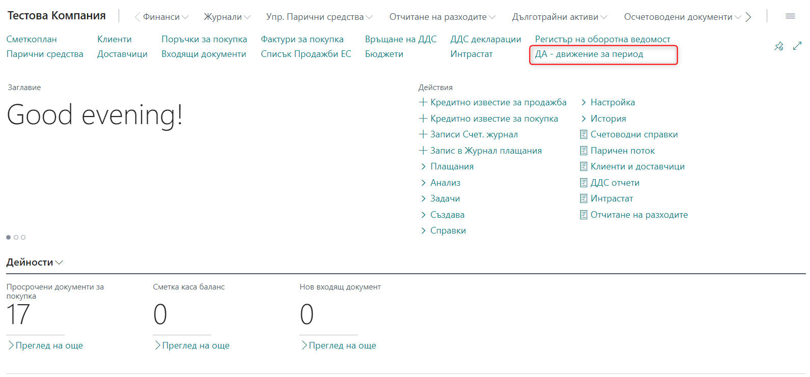{width="6.531944444444444in"
height="3.042361111111111in"}

При стартиране на справката се попълват се следните опции:

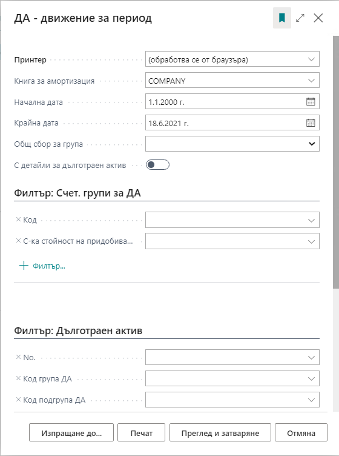{width="3.785611329833771in"
height="5.083534558180228in"}

-   **Книга за амортизация** -- избира се книгата за амортизация --
    счетоводна или данъчна за печат съответно на САП или ДАП

-   **Начална дата** -- начална дата на периода

-   **Крайна дата** -- крайна дата на периода

-   **Общ сбор за група** -- задължително се посочва една от опциите за
    сумиране -- по група на ДА, подгрупа на ДА, местоположение или
    глобални аналитичности

-   **С детайли за дълготраен актив** -- когато тази опция не е
    маркирана, ще се изведат само сумарните редове по посочената по-горе
    опция „Общ сбор за група". При маркиране ще се покажат редове за
    всеки дълготраен актив и общ сбор съгласно опцията „Общ сбор за
    група".

В разделите **Филтър: Счет. групи за ДА** и **Филтър: Дълготраен актив**
допълнително могат да се посочат филтри за определени дълготрайни активи
или техните групи.

**Забележка:** Поради това, че не всички колони на справката могат да се
визуализират при директното ѝ отпечатване на принтер или преглед на
екран, желателно е справката да се експортира в таблица с формат Excel,
в която могат да се видят всички необходими колони.

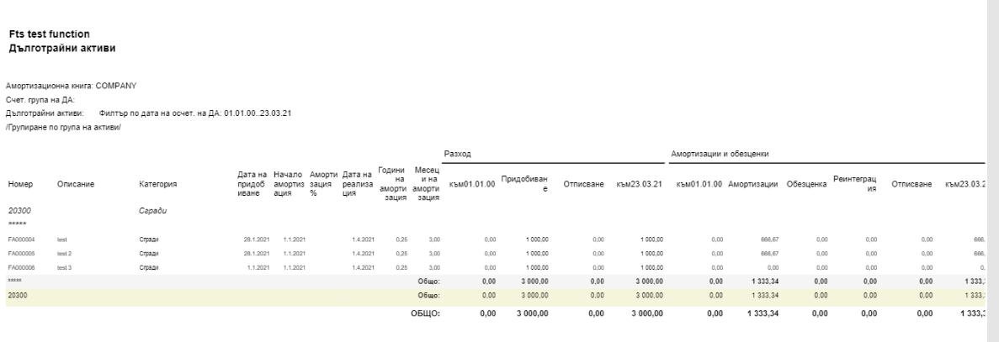{width="7.185989720034995in"
height="2.46875in"}

# Покупки -- настройки, свързани с локализацията

Пакетът Локализация за България добавя някои допълнителни настройки в
модул Покупки.

## Настройка на покупки и задължения

В страница **Настройка на покупки и задължения** има добавени полета,
свързани с ДДС протоколи за покупка и Интрастат, както и настройка за
задължително изискване на код метод на плащане.

{width="6.214075896762905in"
height="2.9287642169728785in"}

-   **ЕС ДДС бизнес счет. група** -- попълва се ДДС бизнес счет.група,
    свързана с ДДС протоколи

-   **Интрастат журнал вкл. допълнителни разходи --** маркира се, за да
    се включат допълнителните разходи в Интрастат декларацията

-   **Задължително Код на метода на плащане -** маркира се, за да
    изисква задължително попълване на код начин на плащане при
    осчетоводяване на покупки.

## Карта на доставчик

В картата на доставчика са добавени полета, свързани с Интрастат
транзакциите - Метод на транспорт, Спецификация на транзакцията и др.
При попълването им в картата на доставчика, след избора му в документ за
покупка, техните стойности се записват в документа. За повече
подробности вижте раздел **Инстрастат** на този документ.

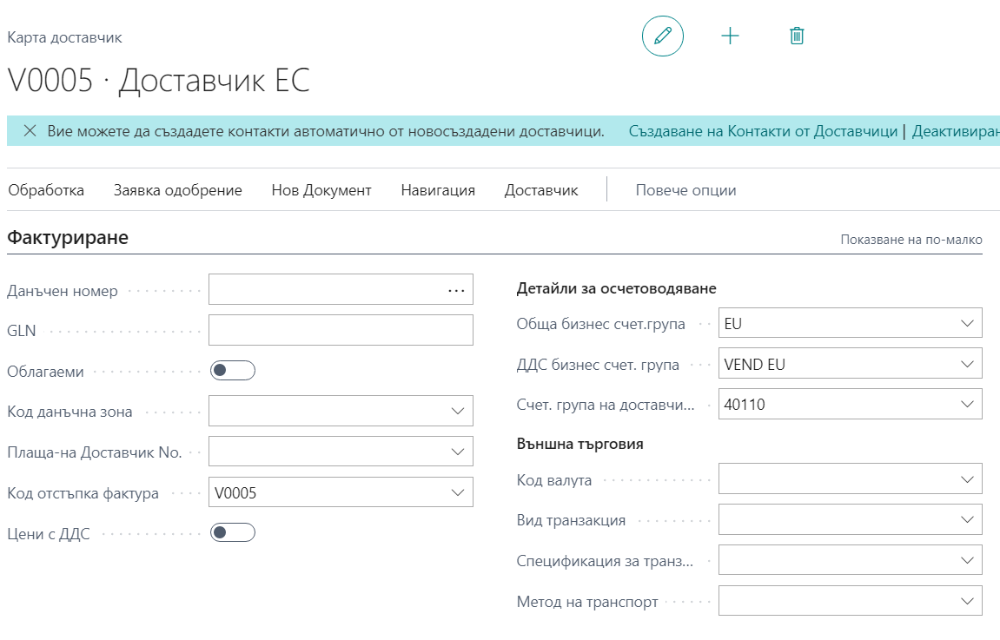{width="6.525in"
height="4.175in"}

## Фактура за покупка

Полетата, които са свързани с локализацията, са поставени в страниците
**Поръчка за покупка** и **Фактура за покупка**. Намират се в следните
раздели:

**Общ**

-   **Дата на данъчно събитие --** попълва се датата на данъчното
    събитие

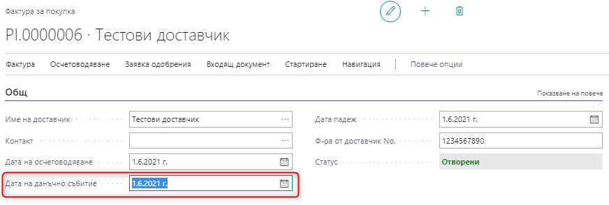{width="6.531944444444444in"
height="2.2020833333333334in"}

**Детайли за фактура**

-   **Идентификационен No.** -- посочва се единният идентификационен
    номер (ЕИК) на доставчика

-   **ДДС описание** -- посочва се описанието на сделката (стока или
    услуга), което ще се покаже в **Дневника за покупки** в поле **ДДС
    описание**. В случай че се остави празно, ще се попълни със
    стойността на поле **ДДС описание на покупки** от страница **BG, ДДС
    и VIES настройки.**

-   **Дебитно известие** -- маркира се в случай, че документът е дебитно
    известие и с него се увеличава стойността на фактура за покупка

-   **Към Фактура No.** -- посочва се номерът на фактурата, към която се
    издава дебитното известие. Избира се от списъка с осчетоводени
    фактури за покупка или се попълва ръчно

-   **Към Фактура дата --** попълва се автоматично с датата на
    фактурата, в случай че номерът на фактурата е избран от списъка на
    осчетоводени фактури за покупка или ръчно, когато номерът на
    фактурата е въведен ръчно

-   **Не включвай в счетоводните книги за ДДС** -- маркира се в
    случаите, когато фактурата не трябва да се показва в ДДС дневника за
    покупки

-   **Основание за неначисл. данък** -- посочва се основанието, въз
    основа на което в стойността на фактурата не е включен ДДС

> 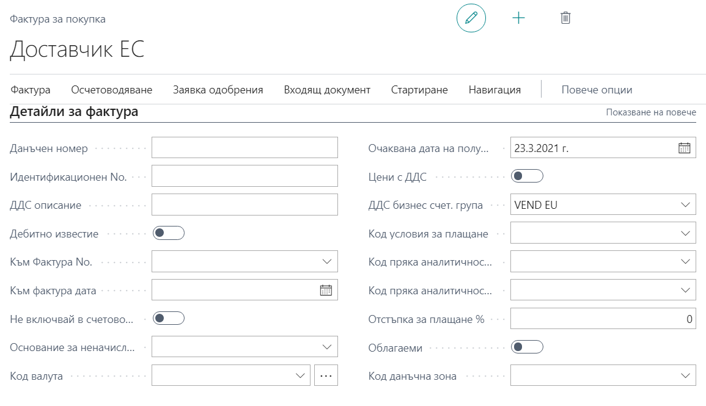{width="6.45in"
> height="3.716666666666667in"}

**Външна търговия**

В този раздел се попълват данни, свързани с Интрастат транзакциите в
случай, че документът е за покупка от ЕС и съдържа артикули. Системата
извежда предупредителни съобщения, ако не са попълнени.

**Важно:** В страница **Информация компания -** раздел **Експедиране,**
поле **Код държава за експедиране** трябва да е попълнено с **BG**. В
случай че в полето липсва код BG, при осчетоводяване на фактура за
покупка от български доставчик, системата ще изисква полетата в раздел
**Външна търговия** да бъдат попълнени.

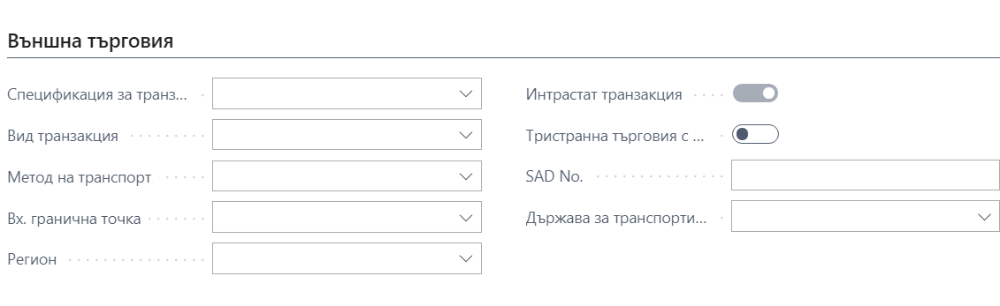{width="6.5in"
height="1.9916666666666667in"}

## Кредитни известия за покупка

Полетата, които са свързани с локализацията, са поставени в страниците
**Кредитно известие за покупка** и **Поръчка за рекламация покупки**.
Намират се в следните раздели:

**Общ**

-   **Дата на данъчно събитие --** попълва се датата на данъчното
    събитие

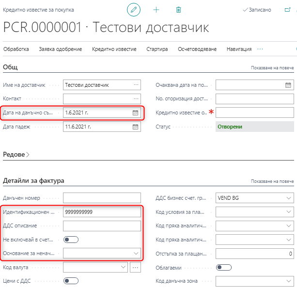{width="6.389689413823272in"
height="6.23333552055993in"}

**Детайли за фактура**

-   **Идентификационен No.** -- посочва се единният идентификационен
    номер (ЕИК) на доставчика

-   **ДДС описание** -- посочва се описанието на сделката (стока или
    услуга), което ще се покаже в **Дневника за покупки** в поле **ДДС
    описание**. В случай че се остави празно, ще се попълни със
    стойността на поле **ДДС описание на покупки** от страница **BG, ДДС
    и VIES настройки**

-   **Не включвай в счетоводните книги за ДДС** -- маркира се в
    случаите, когато фактурата не трябва да се показва в ДДС дневника за
    покупки

-   **Основание за неначисл. данък** -- посочва се основанието, въз
    основа на което в стойността на фактурата не се включва ДДС

**Свързване**

-   **Към Фактура No.** -- посочва се номерът на фактурата, към която се
    издава кредитното известие. Избира се от списъка с осчетоводени
    фактури за покупка или се попълва ръчно.

-   **Към Фактура дата --** попълва се автоматично с датата на
    фактурата, в случай че номерът на фактурата е избран от списъка на
    осчетоводени фактури за покупка или ръчно, когато номерът на
    фактурата е въведен ръчно

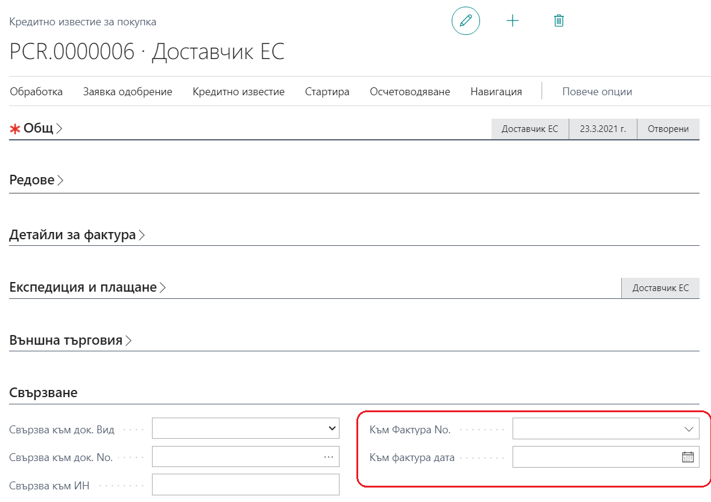{width="6.483333333333333in"
height="4.583333333333333in"}

## Анулиране на осчетоводени фактури и кредитни известия

Анулирането на осчетоводени фактури и кредитни известия за покупки
позволява тези документи да се покажат в ДДС дневниците с нулеви суми.
Анулирането на документ за покупка се извършва от страницата с
осчетоводения документ. От меню **Действия -- Корекция** се избира
**Анулиране на фактура**.

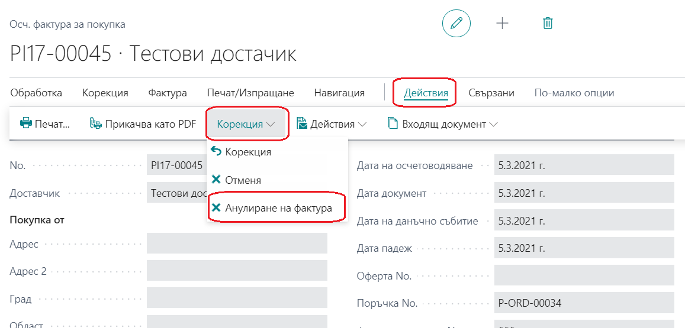{width="6.458333333333333in"
height="3.1in"}

Отваря се прозорец, в който трябва да се въведе **Дата на анулиране**.
Следва да се направи потвърждаване чрез избор на **Затваряне**.

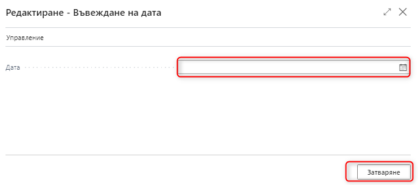{width="4.869594269466317in"
height="2.161963035870516in"}

При това системата извежда следното съобщение:

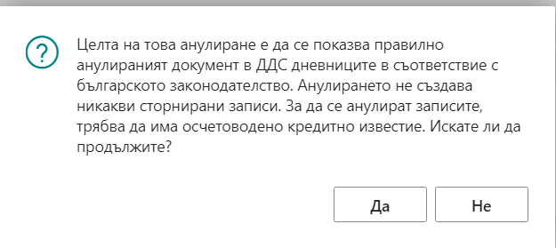{width="4.741666666666666in"
height="2.1166666666666667in"}

След избор на **Да**, системата маркира документа като анулиран - в поле
**Анулиран**. В ДДС дневника той ще се покаже с нулева стойност. За да
се коригира задължението към доставчика със стойността на анулирания
документ, е необходимо да се регистрира Кредитно известие или Фактура за
покупка, които също да бъдат анулирани.

## Промяна на данни в осчетоводени документи

Създадена е възможност за промяна на данни в осчетоводена фактура за
покупка и в осчетоводено кредитно известие за покупка.

Промяната се извършва от страницата с осчетоводения документ.

### Обновяване на осчетоводена фактура за покупка

В страницата **Осч. фактура за покупка** - изберете **Обновяване на
документ** от меню **Действия -- Други**:

{width="6.531944444444444in"
height="1.3833333333333333in"}

В страницата **Осчетоводена фактура за покупка -- Актуалиизация** могат
да бъдат актуализирани данните в следните полета:

Раздел **Детайли за фактура**

-   **Референция на плащане** -- можете да актуализирате полето
    Референция на плащане в осчетоводената фактура

-   **Код начин на плащане** -- можете да актуализирате полето Код начин
    на плащане за фактурата

-   **Кредитор No.** -- можете да актуализирате полето Кредитор No.

-   **Ф-ра от доставчик No.** -- можете да актуализирате номера на
    фактурата от доставчика

-   **Дата на документ** -- указва датата на документа от доставчика

-   **Не включвай в счетоводните книги за ДДС** - можете да
    актуализирате полето дали документът ще бъде включен в ДДС дневникa
    за покупките.

Раздел **Експедиция**

-   **Експедиция към код адрес** -- указва кода на адреса за експедиция,
    избира се от списък с предварително създадени адреси

{width="6.531944444444444in"
height="3.0125in"}

Обновяването се потвърждава с **ОК.**

### Обновяване на осчетоводено кредитно известие за покупка

В страницата **Осч. кред. изв. покупка** изберете **Актуализирай
документа** от меню **Действия -- Други.**

{width="6.531944444444444in"
height="1.823611111111111in"}

В страницата **Осч. кредитно изв. за покупка - Актуализиране** могат да
бъдат актуализирани данните в следните полета:

-   **Код начин на плащане** -- указва начина на плащане за кредитното

-   **Кредитно известие от доставчик No.** -- указва номера на
    кредитното известие от доставчика

-   **Дата на документ** -- указва датата на документа от доставчика

-   **Не включвай в счетоводните книги за ДДС** - указва дали документът
    ще бъде включен в ДДС дневникa за покупките.

{width="6.531944444444444in"
height="2.98125in"}

Обновяването се потвърждава с **ОК.**

##  Анулиране на фактура за покупка в следващ данъчен период

Когато доставчик анулира фактура, която е осчетоводена и отразена в
подаден ДДС дневник, то анулирането трябва да се отрази в следващ
данъчен период.

Необходимо е да се издаде ново кредитно известие за покупка, като в
полето Кредитно известие от доставчик трябва да се въведе номера на
осчетоводената фактура, която е анулирана и трябва да се отрази в
следващ данъчен период, както и да се сложи отметка в полето \"Кредитно
изв. за анулиране на ф-ра\".

По този начин кредитното известие ще се отразява в ДДС дневника с код
01.

{width="6.531944444444444in"
height="2.4456299212598425in"}

# Продажби -- настройки, свързани с локализацията

Пакетът Локализация за България добавя следните допълнителни настройки в
модул Продажби.

## Настройка на потребител

В страница **Настройка на потребители - Карта настройки потребител** има
добавено поле **Дата на осчет. \<\> Работна дата**. В случай че това
поле е маркирано, при осчетоводяване на документи системата няма да
извършва проверка за това дали датата на осчетоводяване се различава от
работната.

Поле **Редактира цени и отстъпки** дава възможност за ограничаване на
правата на потребителя при редактиране на цените и отстъпките по
редовете на документите за продажба. Полето приема стойности
**Забранено** и **Пълни права**. **Забранено** означава, че потребителят
не може да редактира цени и отстъпки. При създаване на нов потребител по
подразбиране той е със забранени права за редакция. В случай, че
потребителят трябва да има права да редактира цени и отстъпки, е
необходимо да се избере опцията **Пълни права**.

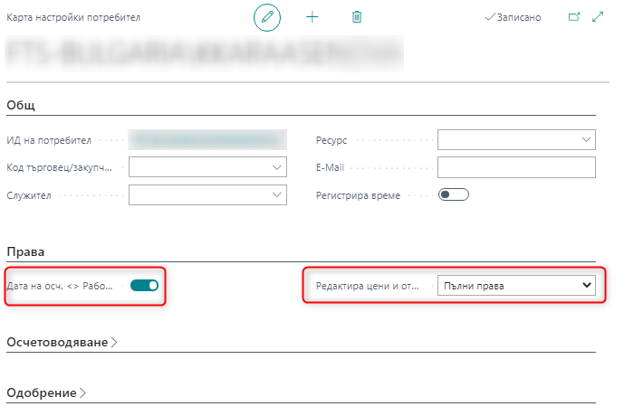{width="6.531944444444444in"
height="4.292361111111111in"}

## Настройка на продажби и вземания

В страница **Настройка на продажби и вземания** има добавени полета в
следните раздели:

**Числени серии**

-   **Числена серия ОПр** -- посочва се числена серия за протоколи за
    продажба преди осчетоводяването им

-   **Числ.сер. ОПр за осч.** -- посочва се числена серия за
    осчетоводени протоколи за продажба

Протоколите за продажба се показват в ДДС дневника за продажби като
документ с код 81.

**Специфични настройки**

-   **Интрастат журнал вкл.** **допълнителни разходи** -- маркира се в
    случаите, когато стойността на допълнителните разходи трябва да се
    включи в стойността на записите в Интрастат журнала за изпращания

-   **Задължително Код на метода на плащане -** маркира се, за да
    изисква задължително попълване на код начин на плащане при
    осчетоводяване на продажби.

{width="6.025676946631671in"
height="2.999936570428696in"}

## Настройка в Информация компания

В страница **Информация компания** са добавени следните полета:

-   **Име на английски** -- попълва се с името на компанията, изписано с
    латински символи. Използва се при отпечатване на документи.

-   **Адрес на английски** - попълва се с адреса на компанията --
    улица/квартал, изписан с латински символи. Използва се при
    отпечатване на документи.

-   **Град на английски** - попълва се с града от адреса на компанията,
    изписан с латински символи. Използва се при отпечатване на
    документи.

-   **Идентификационен номер** -- попълва се единният идентификационен
    номер (ЕИК) на компанията

-   **Изображение 2** -- място за допълнително изображение - фирмен
    знак, използвано при отпечатване на документи

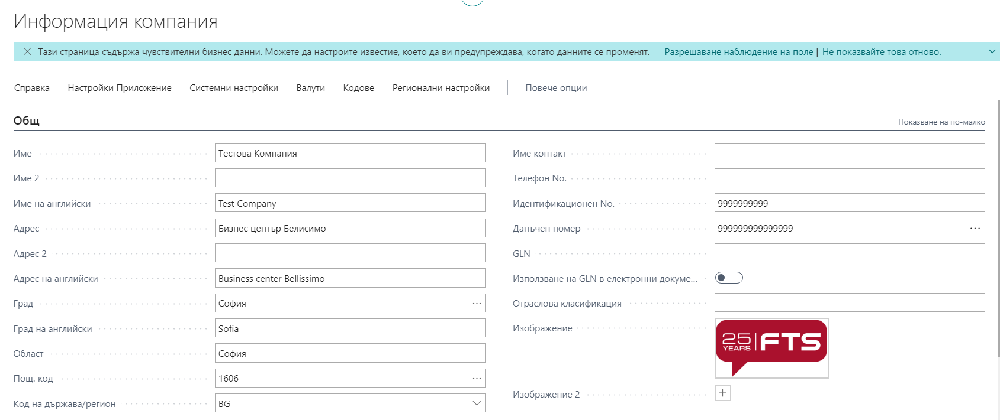{width="6.5in"
height="2.75in"}

## Карта на контакт

В страницата **Карта на контакт** е добавено поле **Идентификационен
номер**. При създаване на клиент или на доставчик от контакт,
съдържанието на това поле се записва в съответната карта на клиент или
на доставчик.

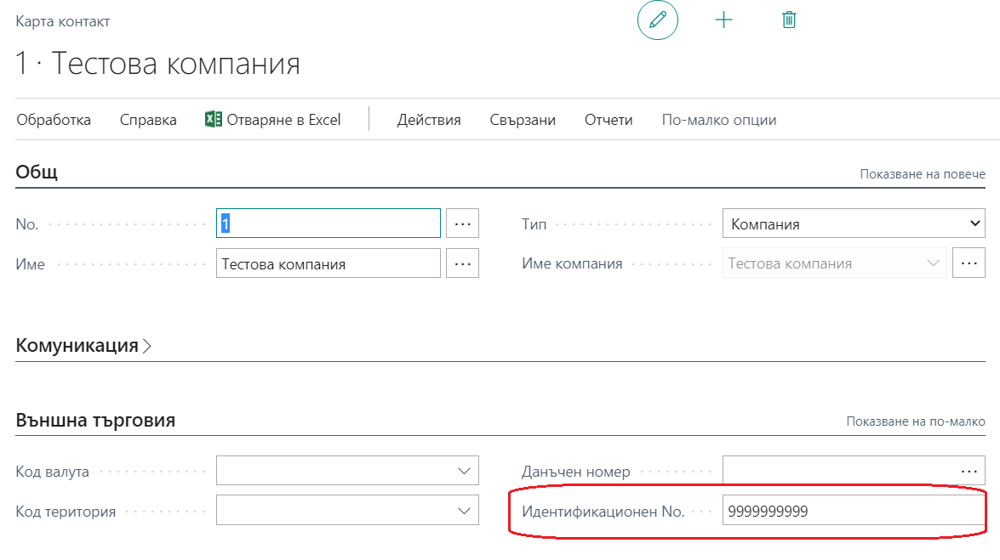{width="5.483333333333333in"
height="3.075in"}

## Карта на клиент

В страницата **Карта на клиент** са добавени полета в следните раздели:

**Фактуриране**

-   **Идентификационен номер** -- попълва се с единния идентификационен
    номер (ЕИК) на клиента

{width="6.531944444444444in"
height="3.1534722222222222in"}

**Хронология за продажби** -- Клиент за продажби

-   **Платен Аванс (МВ)** -- показва размера на платената авансова сума
    от клиента

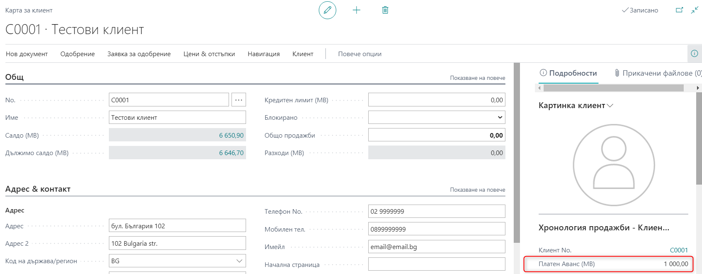{width="6.531944444444444in"
height="2.548611111111111in"}

Добавена е функционалност за извеждане на платената авансова сума от
клиент.

Когато по счетоводната сметка за аванс, посочена в **Обща настройка на
осчетоводяване,** за дадената **Обща бизнес счетоводна група** се
осчетоводи сума, тя се визуализира в карта на клиент, както и в раздел
**Хронология на продажбите** в **Поръчка за продажба** и **Фактура за
продажба**. Платеният аванс се вижда и в Документа за продажба.

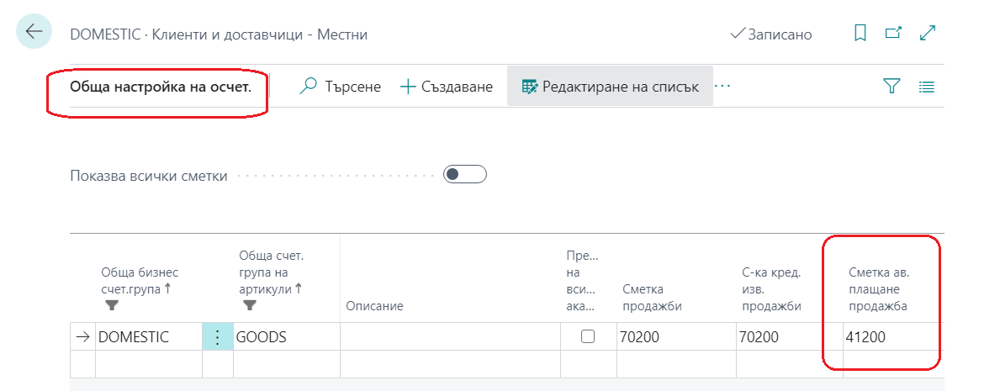{width="5.65in"
height="2.2083333333333335in"}

**Експедиране**

Добавени са полета, свързани с Интрастат декларирането. Тяхното
съдържание се прехвърля в документите за продажба при избор на клиента в
съответния документ. Полетата са следните:

-   Вид транзакция

-   Спецификация за транзакция

-   Метод на транспорт

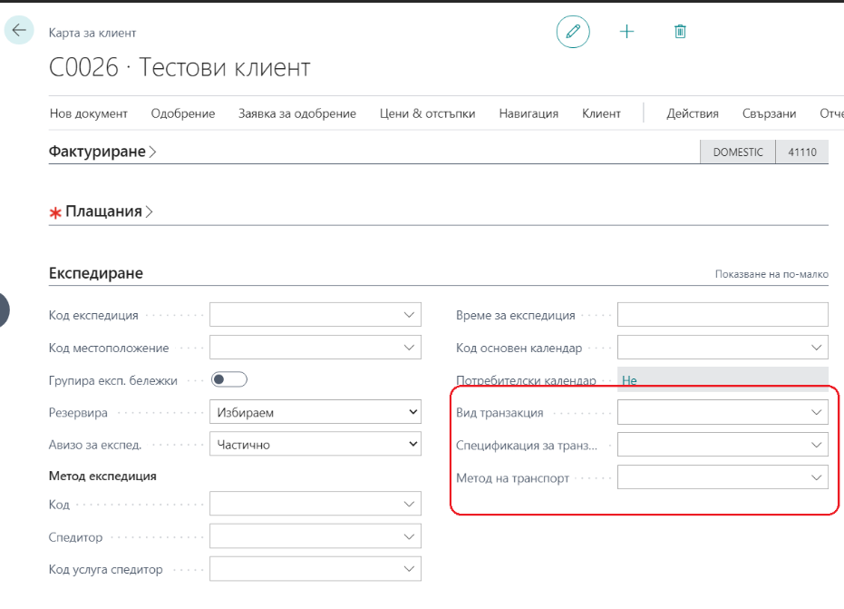{width="4.191666666666666in"
height="3.0166666666666666in"}

## Фактура за продажба

Полетата, които са свързани с локализацията, са поставени в страниците
**Поръчка за продажба** и **Фактура за продажба**. Намират се в следните
раздели:

**Общ**

-   **Дата на данъчно събитие** -- попълва се автоматично с датата на
    осчетоводяване на документа, но може да се променя

-   **Място на сделката** -- попълва се автоматично със стойността на
    поле **Град** от страница **Информация за компания**, но може да се
    променя

-   **Съставител** -- попълва се ръчно

-   **Платен аванс (МВ)** -- показва платената от клиента авансова сума
    в местна валута

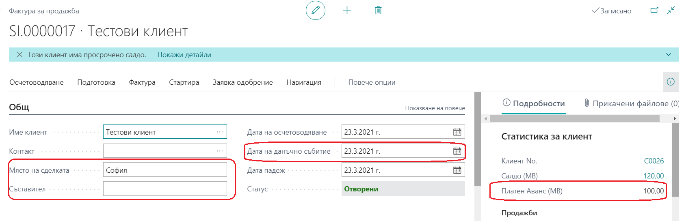{width="6.475in"
height="2.091666666666667in"}

**Детайли за фактура**

-   **Банка No** -- попълва се автоматично с данните за банковата сметка
    от **Информация за компания**. В случай, че за конкретната продажба
    трябва да бъде посочена друга банкова сметка на дружеството, следва
    в това поле да се избере съответното парично средство от списъка с
    парични средства.

-   **ДДС описание** -- попълва се описанието на сделката (стока или
    услуга), което ще се показва в **Дневника за продажби** в колона
    **ДДС описание**. В случай че остане празно, в ДДС дневника ще се
    показва стойността на поле **ДДС описание на продажби** от страница
    **BG, ДДС и VIES настройки.**

-   **Дебитно известие** -- маркира се в случай, че документът се
    издава, за да увеличи стойността на вече осчетоводена фактура

-   **Към Фактура No.** -- попълва се в случаите, когато документът е
    маркиран като дебитно известие. Посочва се номерът на фактурата, към
    която се издава дебитното известие, като този номер се избира от
    списъка с осчетоводени фактури за продажба или се попълва ръчно.

-   **Към Фактура дата --** попълва се автоматично с датата на
    фактурата, посочена в поле **Към фактура No.**, когато тя е избрана
    от списъка с осчетоводени фактури за продажба или се попълва ръчно,
    ако номерът на фактурата е въведен ръчно

-   **Не включвай в счетоводните книги за ДДС** -- показва дали
    документът ще бъде включен в ДДС дневникa за продажбите. Маркира се
    в случаите, когато документът се използва за вътрешни цели.

-   **Основание за неначисляване на ДДС** -- избира се основанието, въз
    основа на което не се начислява ДДС във фактурата. Използва се при
    освободени или необлагаеми сделки.

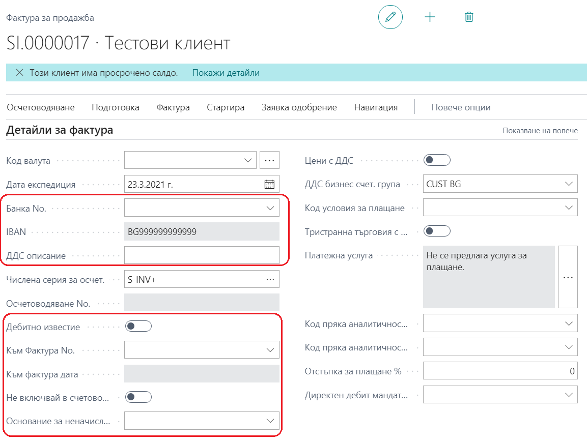{width="6.441666666666666in"
height="4.85in"}

**Външна търговия**

В този раздел се попълват данни за Интрастат транзакциите в случай, че
документът се отнася за продажба към ЕС и съдържа артикули. Системата ще
изведе предупредителни съобщения ако не са попълнени. Данните могат да
се въведат в **Карта на Клиент** и да се попълват по подразбиране във
фактурата за продажба.

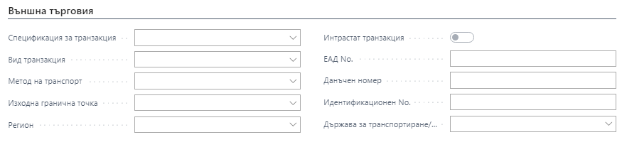{width="6.531944444444444in"
height="1.5972222222222223in"}

**Важно:** В **Информация компания** в раздел **Експедиране** -- поле
**Код държава за експедиране** трябва да е попълнено с код BG. Ако там
липсва код BG, при осчетоводяване на фактури от България системата ще
изисква полетата в раздел **Външна търговия** да бъдат попълнени.

## Кредитно известие за продажба

Полетата, които са свързани с локализацията, са поставени в страниците
**Кредитно известие за продажба** и в **Поръчка за рекламация
продажба**. Намират се в следните раздели:

**Общ**

-   **Дата на данъчно събитие** -- попълва се по подразбиране с датата
    на осчетоводяване, но може да се променя

-   **Място на сделката** -- попълва се автоматично със стойността на
    поле **Град** от страница **Информация за компания**, но може да се
    променя

-   **Съставител** -- попълва се ръчно

-   **Към Фактура No.** -- посочва се номерът на фактурата, към която се
    издава кредитното известие. Избира се от списъка с осчетоводени
    фактури за продажба или се попълва ръчно.

-   **Към Фактура дата --** попълва се автоматично с датата на
    фактурата, в случай че номерът на фактурата е избран от списъка с
    осчетоводени фактури за продажба или ръчно, когато номерът на
    фактурата е въведен ръчно

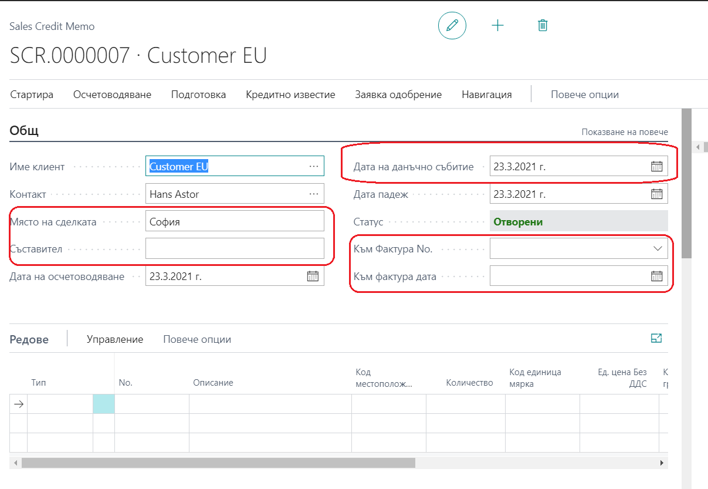{width="6.441666666666666in"
height="4.441666666666666in"}

**Детайли за кредитно известие**

-   **Банка No** -- попълва се автоматично с данните за банковата сметка
    от **Информация за компания**. В случай, че за конкретния документ
    трябва да бъде посочена друга банкова сметка на дружеството, следва
    в това поле да се избере съответното парично средство от списъка с
    парични средства.

-   **ДДС описание** -- посочва се описанието на сделката (стока или
    услуга), което ще се покаже в **Дневника за продажби** в поле **ДДС
    описание**. В случай че се остави празно, ще се попълни със
    стойността на поле **ДДС описание на продажби** от страница **BG,
    ДДС и VIES настройки**

-   **Не включвай в счетоводните книги за ДДС** -- маркира се в
    случаите, когато документът не трябва да се показва в ДДС дневника
    за продажби

-   **Основание за неначисл. данък** -- посочва се основанието, въз
    основа на което в стойността на документа не се включва ДДС.
    Използва се при освободени или необлагаеми сделки.

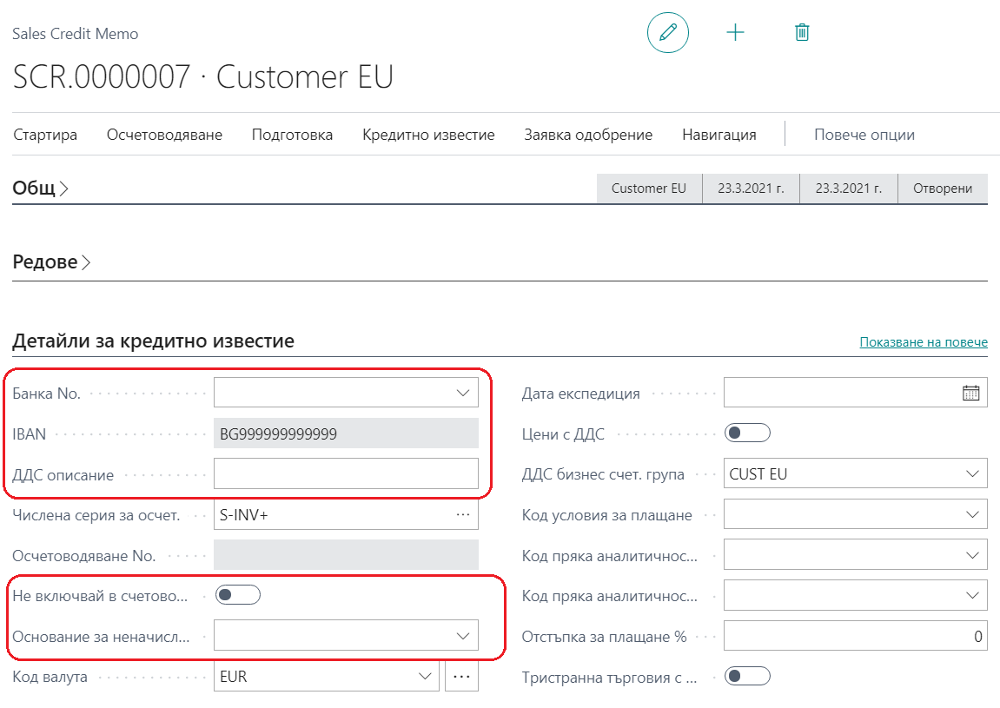{width="6.525in"
height="4.616666666666666in"}

**Раздел Външна търговия**

В този раздел се попълват данни за Интрастат транзакциите в случай, че
документът се отнася за продажба към ЕС и съдържа артикули. Системата ще
изведе предупредителни съобщения, ако не са попълнени. Данните могат да
се въведат в **Карта на Клиент** и да се попълват по подразбиране в
кредитното известие за продажба.

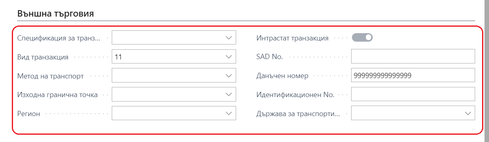{width="6.491666666666666in"
height="1.9in"}

## Печат на Фактура и Кредитно известие за продажба

За отпечатване на фактура или на кредитно известие е необходимо да се
направи следната настройка:

За фактури - в страница **Избор справка -- продажби** се избира опцията
**Фактура,** а в поле **Справка ID** се посочва обекта, с който се
управлява отпечатването на фактура -- отчет Продажби -- Фактура. За
кредитно известие се избира опцията Кредитно известие, а в поле
**Справка ID** се поставя обект Кредитно известие.

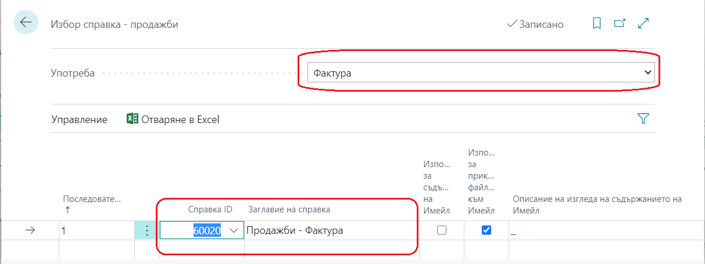{width="5.658333333333333in"
height="2.125in"}

Подготовката за отпечатване на фактура или на кредитно известие се
активира с действие **Печат --** от списъка с осчетоводените фактури или
кредитни известия или от страницата (картата) на фактурата или
кредитното известие.

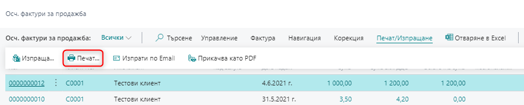{width="6.531944444444444in"
height="1.3076388888888888in"}

Отваря се прозорец със заявка за печат, в който може да се посочи какво
да включва разпечатката:

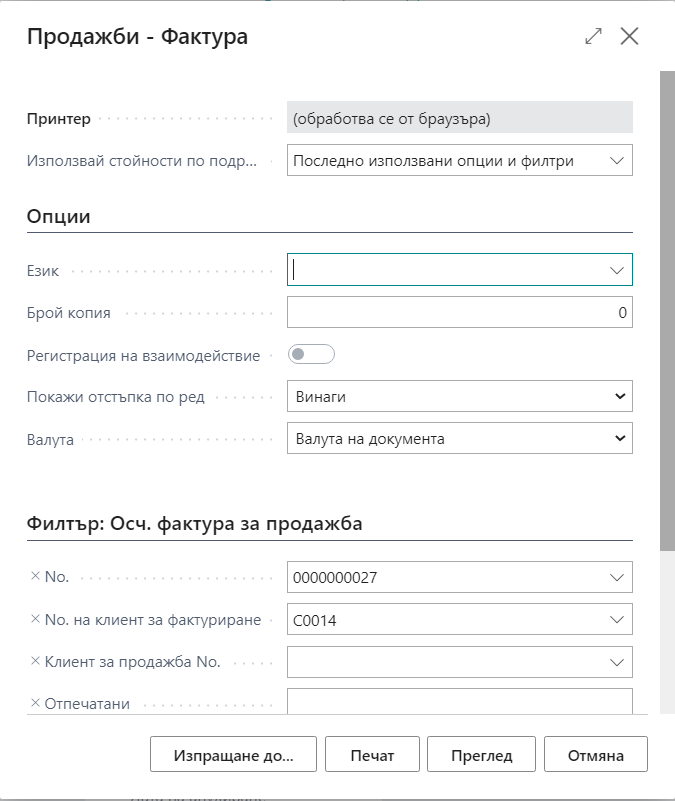{width="3.8582392825896763in"
height="4.578920603674541in"}

-   **Език** -- посочва се езикът, който ще се използва при отпечатване
    на документа

-   **Брой копия --** посочва се броят на копията, освен оригинала на
    документа, които ще се отпечатват

-   **Регистрация на взаимодействие -** отпечатването на фактурата може
    да се регистрира като взаимодействие в CRM модула на системата

-   **Покажи отстъпка за ред** -- посочва се дали в отпечатания документ
    да се показва отстъпката по редовете. Полето има следните опции:

**Винаги** -- означава, че отстъпката винаги ще се показва в отделна
колона в отпечатвания документ

**Никога** -- означава, че няма да се показва отстъпката по редовете в
отпечатвания документ

**Автоматично** -- означава, че ако в документа има отстъпка, тя ще се
показва в отделна колона при отпечатване, а ако няма остъпка - колоната
няма да се покаже

-   **Валута** -- посочва се валутата, в която се измерва стойността на
    фактурата. Опциите са: **Валута на документа** (сумите се показват в
    оригиналната валута на документа) и **Местна Валута** (сумите се
    показват в местна валута, лева).

След избор на **Преглед**, **Печат** или **Изпращане до PDF/Word/Excel
Документ** фактурата и кредитното известие се визуализират по следния
начин:

{width="6.531944444444444in"
height="5.725in"}

{width="6.531944444444444in"
height="5.602083333333334in"}

В таблица по-долу може да се намери информация за полетата в документите
и техните източници в системата при отпечатване на български и на
английски език:

  ------------------------------------------------------------------------
  **Поле в           **Източник (бълг.език)**   **Източник (англ.език)**
  документа**                                   
  ------------------ -------------------------- --------------------------
  Клиент -- име      Фактура -- Клиент за       Фактура -- Клиент за
                     фактуриране -- поле Име    фактуриране -- поле Име

  Клиент - адрес     Фактура -- Клиент за       Фактура -- Клиент за
                     фактуриране -- поле Адрес  фактуриране -- поле Адрес

  Клиент - град      Фактура -- Клиент за       Фактура -- Клиент за
                     фактуриране -- поле Град   фактуриране -- поле Град
                     (въведен на български в    (ако е въведен на
                     номенклатурата)            български, системата ще го
                                                преведе автоматично на
                                                английски)

  Клиент - държава   Фактура -- Клиент за       Фактура -- Клиент за
                     фактуриране -- поле Код    фактуриране -- поле Код
                     държава                    държава (имената на
                                                държавите на английски се
                                                предоставят в пакета за
                                                начална конфигурация)

  Клиент -- данъчен  Фактура -- Клиент за       Фактура -- Клиент за
  номер              фактуриране -- поле        фактуриране -- поле
                     Данъчен номер              Данъчен номер

  Клиент -           Фактура -- Клиент за       Фактура -- Клиент за
  идентификационен   фактуриране -- поле        фактуриране -- поле
  номер              Идентификационен номер     Идентификационен номер

  Клиент - МОЛ       Клиент -- Адрес&Контакт -- Клиент -- Адрес&Контакт --
                     Име на Контакт             Име на Контакт

  Доставчик -- Лого, В страница Информация      В страница Информация
  Име, Адрес, Град,  компания -- секция Общи    компания -- секция Общи
  Държава,                                      
  Идентификационен                              
  номер, Данъчен                                
  номер                                         

  Доставчик --       В страница Информация      В страница Информация
  Банка, IBAN, Swift компания -- секция         компания -- секция
  код                Плащания                   Плащания

  Фактура Номер      Фактура -- Общи - поле No. Фактура -- Общи - поле No.

  Дата               Фактура -- Общи -- поле    Фактура -- Общи -- поле
                     Дата на документ           Дата на документ

  Дата на падеж      Фактура -- Общи - поле     Фактура -- Общи -- поле
                     Дата на падеж              Дата на падеж

  №                  Фактура - Редове - номер   Фактура - Редове -- номер
                     на ред                     на ред

  Артикул номер      Фактура - Редове -- поле   Фактура - Редове -- поле
                     No. за артикул, сметка,    No. за артикул, сметка,
                     дълготраен актив           дълготраен актив

  Описание           Фактура -- Редове -- поле  Фактура - Редове -- поле
                     Описание                   Описание (преводът на
                                                английски се взема от
                                                карта на артикул -- меню
                                                Свързани -- Артикул --
                                                Преводи)

  Ед. Мярка          Фактура - Редове -- поле   Фактура - Редове -- поле
                     Код единица мярка          Код единица мярка
                                                (преводът на английски се
                                                взема от страница Мерни
                                                единици -- меню Свързани
                                                -- Единица -- Преводи)

  Кол.               Фактура - Редове -- поле   Фактура - Редове -- поле
                     Количество                 Количество

  Основна цена       Фактура - Редове -- поле   Фактура - Редове -- поле
                     Единична цена без ДДС,     Единична цена без ДДС,
                     преди отстъпка             преди отстъпка

  Отст.%             Фактура - Редове -- поле   Фактура - Редове -- поле
                     Отстъпка за ред %          Отстъпка за ред %

  Ед. цена           Фактура - Редове --        Фактура - Редове --
                     Единична цена след         Единична цена след
                     отстъпка (изчислимо поле)  отстъпка (изчислимо поле)

  Сума (без ДДС)     Фактура - Редове -- поле   Фактура - Редове -- поле
                     Сума за ред без ДДС        Сума за ред без ДДС

  ДДС основа лева    Фактура -- поле Обща сума  Фактура -- поле Обща сума
                     без ДДС (лева)             без ДДС (лева)

  20% ДДС            Фактура -- поле Общо ДДС   Фактура -- поле Общо ДДС
                     (лева). % ДДС се определя  (лева). % ДДС се определя
                     от ДДС комбинациите на     от ДДС комбинациите на
                     първия ред.                първия ред.

  Сума за плащане    Фактура -- поле Дължима    Фактура -- поле Дължима
  лева               сума (вкл. ДДС) (лева)     сума (вкл. ДДС) (лева)

  Външен документ    Фактура -- Детайли за      Фактура -- Детайли за
  No.                фактура -- поле Външен     фактура -- поле Външен
                     документ No.               документ No.

  Метод на плащане   Фактура -- Детайли за      Фактура -- Детайли за
                     фактура - поле Код начин   фактура - поле Код начин
                     на плащане                 на плащане (превод)

  Условия на         Фактура -- Детайли         Фактура -- Детайли
  доставка           експедиция - поле Метод    експедиция - поле Метод
                                                (преводът на английски се
                                                взема от страница Методи
                                                експедиция -- бутон
                                                Превод)

  Място на сделката  Фактура -- Общи -- поле    Фактура -- Общи -- поле
                     Място на сделката (попълва Място на сделката (попълва
                     се във фактурата със       се във фактурата със
                     стойността на поле Град от стойността на поле Град от
                     страница Информация        страница Информация
                     компания, секция Общи)     компания, секция Общи)

  Дата на данъчно    Фактура -- Общи -- поле    Фактура -- Общи -- поле
  събитие            Дата на данъчно събитие    Дата на данъчно събитие

  Основание за       Фактура -- Детайли за      Фактура -- Детайли за
  неначисляване на   фактура -- поле Основание  фактура -- поле Основание
  ДДС                за ненач. данък            за ненач. Данък (преводът
                                                на английски се взема от
                                                страница ДДС клаузи --
                                                бутон Превод)

  Получено от:       Фактура -- Клиент за       Фактура -- Клиент за
                     фактуриране -- поле        фактуриране -- поле
                     Контакт                    Контакт

  Съставител:        Фактура -- Общи - поле     Фактура -- Общи - поле
                     Съставител                 Съставител (ако е въведен
                                                на български, системата ще
                                                го преведе автоматично на
                                                английски)

  Към фактура -      Фактура (Дебитно известие) Фактура (Дебитно известие)
  номер              / Кредитно известие --     / Кредитно известие --
                     Детайли за фактура -- поле Детайли за фактура -- поле
                     Към Фактура No.            Към Фактура No.

  Към фактура - дата Фактура (Дебитно известие) Фактура (Дебитно известие)
                     / Кредитно известие --     / Кредитно известие --
                     Детайли за фактура -- поле Детайли за фактура -- поле
                     Към фактура дата           Към фактура дата
  ------------------------------------------------------------------------

## Протокол за продажба

Подобно на Фактурите за продажба, Протоколите за продажба се създават
като документ за продажба. Създадените, но неосчетоводените протоколи се
намират в **Списък протоколи за продажба.** Този списък е отделен от
списъците с други документи за продажба (фактура, поръчка).

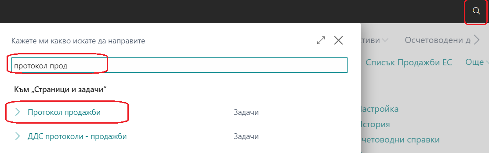{width="6.491666666666666in"
height="2.033333333333333in"}

Страницата **Протокол за продажба** е подобна на страницата **Фактура за
продажба**. Разликата е само в това, че протоколът е маркиран в поле
**Протокол за продажба**.

След осчетоводяване Протоколите за продажба се показват в списъка с
осчетоводени фактури, като могат да се разграничат от фактурите по
маркировката в полето **Протокол за продажба**. Числената серия за
номерата на осчетоводените протоколи за продажба не трябва да съвпада с
тази на фактурите за продажба. Този тип документи -- протоколи за
продажба - се показват в ДДС дневника за продажби с код 81.

Изгледът на печатната форма на протокола за продажба е подобен на
изгледа на печатната форма на фактурата за продажба. Разликата е, че за
протокола името на отпечатания документ е **Протокол за продажба.**

{width="6.531944444444444in"
height="5.672916666666667in"}

## Анулиране на Фактура или Кредитно известие за продажба

Анулирането на осчетоводени фактури и кредитни известия за продажби
позволява тези документи да се покажат в ДДС дневниците с нулеви суми.
Анулиране на документ за продажба се извършва от страницата с
осчетоводения документ. От меню **Действия** се избира **Анулиране на
фактура** за осчетоводени фактури или **Анулиране на кредитно известие**
за осчетоводени кредитни известия.

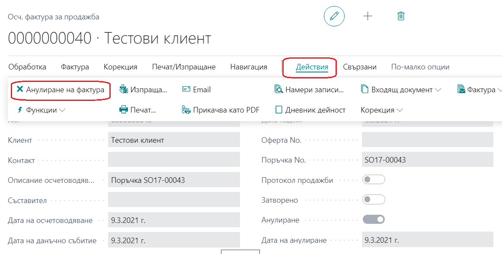{width="6.483333333333333in"
height="3.2916666666666665in"}

Отваря се прозорец, в който трябва да се въведе **Дата на анулиране**.
Следва потвърждаване чрез избор на **Затваряне**.

{width="4.869594269466317in"
height="2.161963035870516in"}

При това системата извежда следното съобщение:

{width="4.741666666666666in"
height="2.1166666666666667in"}

След избор на **Да**, системата маркира документа като анулиран - в поле
**Анулиран**. В ДДС дневника той ще се покаже с нулева стойност. За да
се коригира задължението на клиента със стойността на анулирания
документ, е необходимо да се регистрира Кредитно известие (при анулирана
фактура) или Фактура за продажба (при анулирано кредитно известие),
които също да бъдат анулирани.

## Промяна на данни в осчетоводени документи за продажба

Създадена е възможност за промяна на данни в осчетоводена фактура за
продажба и в осчетоводено кредитно известие за продажба.

Промяната се извършва от страницата с осчетоводения документ.

### Обновяване на осчетоводена фактура за продажба

В страницата **Осч. фактура за продажба** изберете **Обновяване на
документ** от меню **Действия -- Други**.

{width="6.531944444444444in"
height="2.3722222222222222in"}

В страницата **Осчетоводени фактури продажба -- Актуализация** могат да
бъдат актуализирани данните в следните полета:

Раздел **Детайли за фактура**

-   **Не включвай в счетоводните книги за ДДС** - указва дали документът
    ще бъде включен в ДДС дневникa за покупките.

Раздел **Плащане**

-   **Референция на плащане --** можете да актуализирате полето
    Референция на плащане в осчетоводената фактура за продажба

-   **Код начин на плащане --** указва начина на плащане за фактурата

-   **Код на парично средство на компанията** -- указва Код на парично
    средство на компанията в картата на осчетоводената фактура за
    продажба

{width="6.531944444444444in"
height="2.75in"}

Обновяването се потвърждава с **ОК.**

### Обновяване на осчетоводено кредитно известие за продажба

В страницата **Осч. кред. известие по продажба** изберете **Обновяване
на документ** от меню **Действия -- Други**.

{width="6.531944444444444in"
height="2.0756944444444443in"}

В страницата **Осчетоводени Кр. Известия за продажба - Актуализиране**
могат да бъдат актуализирани данните в следните полета:

Раздел **Детайли за фактура**

-   **Не включвай в счетоводните книги за ДДС** - указва дали документът
    ще бъде включен в ДДС дневник за покупките.

Раздел **Експедиране**

-   **Спедитор** -- указва код на спедитор, който се използва за
    транспортиране на артикулите от документа за продажба. Може да
    актуализирате полето, като изберете от предварително създадени карти
    на спедитори.

-   **Код услуга спедитор** -- указва коя услуга на спедитор се използва
    за транспортиране на артикулите от документа за продажба

-   **Контролен пакет No.** -- указва номера на пакета на спедитора

Раздел **Плащане**

-   **Код на парично средство на компанията** -- указва Код на парично
    средство на компанията в картата на осчетоводената фактура за
    продажба.

{width="6.531944444444444in"
height="2.7875in"}

Обновяването се потвърждава с **ОК.**
